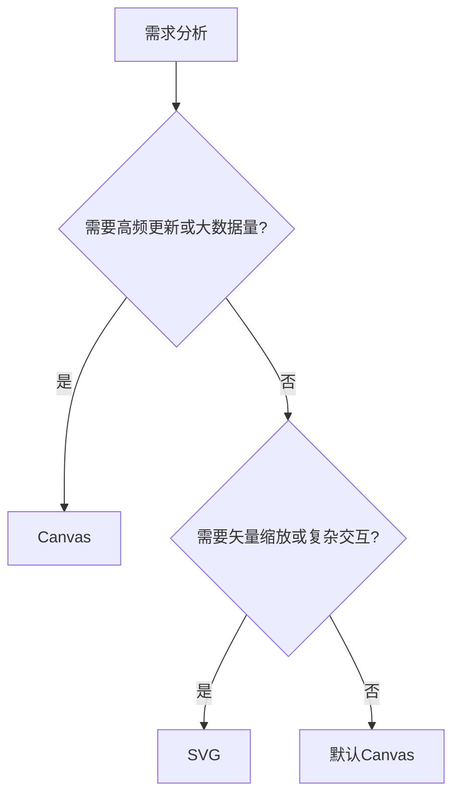

在数据可视化库（如 ECharts、Three.js 等）中，`CanvasRenderer` 和 `SVGRenderer` 是两种常见的渲染方式，它们的核心区别和选型建议如下：

### **一、核心区别对比**

| **特性**       | **CanvasRenderer**                    | **SVGRenderer**                         |
| -------------- | ------------------------------------- | --------------------------------------- |
| **渲染技术**   | 基于像素的位图渲染（`<canvas>` 元素） | 基于矢量的 DOM 渲染（`<svg>` 元素）     |
| **性能**       | ✅ 高频更新（如动画、大数据量）更流畅 | ⚠️ 适合静态或低频更新场景               |
| **内存占用**   | 较低（单一块画布）                    | 较高（大量 DOM 节点）                   |
| **缩放表现**   | ⚠️ 放大时像素模糊                     | ✅ 无限缩放不失真                       |
| **交互灵活性** | 需手动实现事件检测                    | ✅ 原生支持 DOM 事件（如点击、悬停）    |
| **兼容性**     | 兼容所有现代浏览器                    | 兼容性稍差（部分旧浏览器 SVG 支持有限） |
| **导出图片**   | ✅ 直接转 PNG/JPG                     | 需转换为位图（可能失真）                |
| **动态效果**   | 适合复杂动画/游戏                     | 适合简单过渡效果                        |

---

### **二、选型决策指南**

#### **优先选择 `CanvasRenderer` 当：**

1. **数据量巨大**（如万级以上的散点图）

   ```javascript
   // ECharts 示例
   chart.setOption({
     renderer: "canvas",
     series: [
       {
         type: "scatter",
         data: [
           /* 大量数据点 */
         ],
       },
     ],
   });
   ```

2. **高频动态更新**（如实时监控仪表盘）
3. **需要复杂视觉效果**（如 WebGL 混合渲染）
4. **移动端性能敏感场景**（减少 DOM 压力）

#### **优先选择 `SVGRenderer` 当：**

1. **需要矢量无损缩放**（如高精度地图）

   ```javascript
   // ECharts 示例
   chart.setOption({
     renderer: "svg",
     series: [{ type: "line", smooth: true }],
   });
   ```

2. **依赖 DOM 交互**（如复杂的图元点击检测）
3. **导出矢量图**（如 PDF/SVG 格式报表）
4. **SEO 友好需求**（SVG 内容可被爬虫解析）

---

### **三、技术实现对比**

#### **Canvas 渲染原理**


- **优点**：减少 DOM 操作，适合高频重绘
- **缺点**：事件处理需手动计算坐标（如 `getBoundingClientRect`）

#### **SVG 渲染原理**


- **优点**：原生支持 CSS 动画和事件
- **缺点**：大量元素时性能下降明显

---

### **四、性能实测数据**

| **场景**               | Canvas (FPS) | SVG (FPS) |
| ---------------------- | ------------ | --------- |
| 静态图表（1000 元素）  | 60           | 60        |
| 动态更新（1000 点/秒） | 55-60        | 20-30     |
| 极大数据量（10 万点）  | 30-40        | <5        |

> _测试环境：Chrome 120 / i7-12700H / ECharts 5.4_

---

### **五、切换渲染器的示例**

#### **1. ECharts 中动态切换**

```javascript
// 初始化时指定渲染器
const chart = echarts.init(dom, null, {
  renderer: "canvas", // 或 'svg'
});

// 运行时切换（需 dispose 后重新 init）
chart.dispose();
chart = echarts.init(dom, null, { renderer: "svg" });
```

#### **2. Three.js 的 2D 渲染选择**

```javascript
// Canvas 2D 渲染
const renderer = new THREE.CanvasRenderer();

// SVG 渲染（需插件如 three-svg-renderer）
import { SVGRenderer } from "three-svg-renderer";
const renderer = new SVGRenderer();
```

---

### **六、混合渲染策略**

对于复杂项目，可组合使用两者：

1. **主图表用 Canvas**（保证性能）
2. **交互元素用 SVG**（如标注、Tooltip）

```javascript
// ECharts 混合模式
chart.setOption({
  graphic: [{ type: 'text', style: { text: '标注', x: 100, y: 100 } }], // SVG
  series: [{ type: 'bar', data: [...] }] // Canvas
});
```

---

### **七、常见误区**

1. **误区**：认为 SVG 一定比 Canvas 慢  
   **纠正**：在元素量 <1000 时，SVG 的交互优势更明显。

2. **误区**：Canvas 无法实现复杂交互  
   **纠正**：可通过 `pick` 方法或库（如 Konva）实现精准事件检测。

---

### **总结选择流程**



根据具体场景灵活选择，必要时可借助 `window.devicePixelRatio` 和性能监控动态调整。
