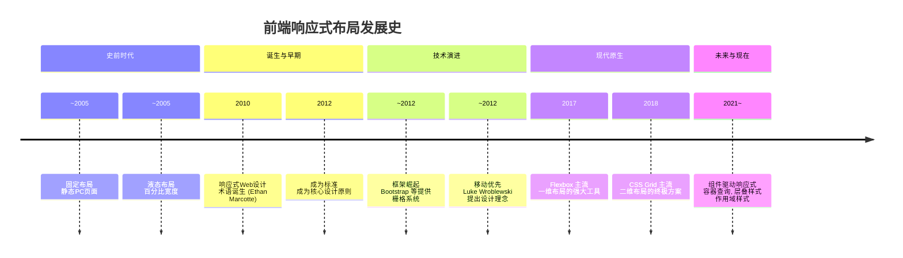

好的，前端响应式布局的发展历史是一段从粗糙到精细、从「Hack」到「原生」、从「布局」到「体验」的演进史。它不仅是技术的进步，更是 Web 设计哲学的变化。

以下是其发展的主要阶段和时间线：



## 史前时代 - 固定布局与液态布局 (~2005)

在“响应式设计”这个概念出现之前，开发者们已经在尝试解决多设备浏览的问题。

### 固定布局 (Fixed Layout)

- **做法**：使用以 `px` 为单位的固定宽度（如 960px、1200px），通常居中显示。
- **局限性**：在不同设备上，要么显示不全出现横向滚动条，要么两侧有大片空白。这是最早期的、只为桌面端设计的方案。

### 液态布局 (Liquid Layout / Fluid Layout)

- **做法**：使用百分比 (`%`) 而非像素来定义宽度，布局会随浏览器窗口大小而“流动”。
- **局限性**：布局虽然可变，但当窗口过大或过小时，排版会变得难以阅读（行长过长或过短）。缺乏精细的控制。

## 响应式诞生与早期 (2010 - 2012)

这是响应式设计从无到有的关键阶段，其核心突破是 **CSS3 Media Queries（媒体查询）** 的引入。

#### 标志性事件

**2010 年**：网页设计师 **Ethan Marcotte** 在《A List Apart》上发表开创性文章 **[Responsive Web Design](https://alistapart.com/article/responsive-web-design/)**，首次提出了“响应式网页设计”（RWD）这个术语。

**核心三要素**：

- **流体网格 (Fluid Grids)**：基于百分比的布局。
- **弹性图片/媒体 (Flexible Images)**：`max-width: 100%;` 防止媒体溢出容器。
- **媒体查询 (Media Queries)**：根据设备特性（如屏幕宽度、分辨率）应用不同的 CSS 样式。

#### 早期实践

- 通过媒体查询设置不同的 **断点 (Breakpoints)**，为不同宽度的设备（手机、平板、桌面）编写不同的 CSS 规则。
- **移动端优化**：添加 `viewport` meta 标签，让移动浏览器正确渲染页面比例。

```html
<meta name="viewport" content="width=device-width, initial-scale=1.0" />
```

## 框架崛起与移动端优先 (2012 - 2015)

随着移动设备爆炸式增长，响应式成为**必备需求**而非可选功能。为了提高开发效率，一系列响应式 CSS 框架应运生。

#### CSS 框架的黄金时代

**Bootstrap**、**Foundation** 等框架迅速流行。它们提供了强大的**栅格系统 (Grid System)**，开发者通过添加预定义的类（如 `.col-md-6`, `.col-sm-12`）就能快速构建响应式布局，极大降低了开发门槛。

#### 设计理念转变：移动优先 (Mobile First)

提出者为 **Luke Wroblewski**。其理念为：**从为移动设备设计开始，然后逐步增强，去适配更大尺寸屏幕，添加更复杂的功能**。这颠覆了传统的“桌面优先再删减”的思路。

技术实现上，使用 `min-width` 媒体查询，而不是 `max-width`。

```css
/* 移动优先样式 (默认) */
.container {
  width: 100%;
}
/* 平板及以上 */
@media (min-width: 768px) {
  .container {
    width: 750px;
  }
}
/* 桌面及以上 */
@media (min-width: 992px) {
  .container {
    width: 970px;
  }
}
```

## 现代布局的诞生 - Flexbox 与 Grid (2015 - 2018)

虽然媒体查询解决了“不同设备不同样式”的问题，但**单个容器内的内部布局**依然很棘手。CSS 原生强大布局模块的成熟真正解决了这个问题。

#### Flexbox (弹性盒子布局)

- **解决核心**：**一维布局**（行或列）问题。提供了空间分配、对齐、排序的强大能力，完美取代了过去的 Float 和 Inline-block Hack。
- **应用**：导航栏、卡片组件、垂直居中等任何需要线性布局的场景。

#### CSS Grid (网格布局)

- **解决核心**：**二维布局**（行和列同时）问题。允许开发者直接定义行和列，然后将项目精确地放置到网格区域中。这是布局领域的终极武器。
- **意义**：让原生 CSS 布局能力达到了前所未有的高度，许多之前需要复杂 Hack 或 JavaScript 才能实现的布局现在几行 CSS 就能搞定。

## 组件驱动下的响应式新方案 (2018 - 至今)

媒体查询是基于 **整个视口（viewport）** 的，但现代前端开发是 **组件化** 的。一个组件应该根据 **其自身容器的大小** 而非屏幕大小来调整样式，这才是更合理的逻辑。

#### 容器查询 (Container Queries)

- **概念**：允许组件根据其父容器的宽度（而非视口宽度）来应用样式。这被誉为“下一个改变游戏规则的 CSS 特性”。
- **支持**：**2023 年**，主流浏览器全面支持，标志着响应式设计进入新时代。
- **代码示例**：

```html
<div class="card-container">
  <div class="card">
    <!-- 卡片内容 -->
  </div>
</div>
```

```css
.card-container {
  container-type: inline-size;
}

/* 当.card的容器宽度大于400px时 */
@container (min-width: 400px) {
  .card {
    display: flex;
  }
}
```

#### CSS 层叠样式 (CSS Layers)

你可以将 CSS层叠层（Layers） 理解为一个个预制的规则集。每个集合里可以装很多CSS规则。

浏览器在计算样式时，不再是直接比较CSS规则的特异性，而是先比较这些规则集的优先级。

无论你的css选择器的特异性多高，后声明的层中的样式，总是会覆盖先声明的层中的同名样式。

在相同层内，会根据css规则的特异性进行比较，特异性高的样式会覆盖特异性低的样式，后声明的样式覆盖先声明的同名样式。

```html
<button class="my-btn">Click Me</button>
```

```css
/* 定义一个层的顺序：base层最先，theme层最后（优先级最高） */
@layer base, theme;

/* 在 base 层：规则特异性很高 */
@layer base {
  #page .button { background-color: grey; }
}

/* 在 theme 层：规则特异性非常低 */
@layer theme {
  .my-btn { background-color: blue; }
}
```

###### 作用域样式 (Scope Styles)

允许在 CSS 中定义样式的作用域，更好地适配组件化开发。定义的规则，只在当前组件生效

```css 
<style scoped></style>
```

---

## 总结与对比

| 阶段           | 核心技术/理念        | 优点                       | 缺点                       |
| -------------- | -------------------- | -------------------------- | -------------------------- |
| **史前时代**   | 固定宽度、液态布局   | 简单、可控                 | 体验差、不灵活             |
| **早期响应式** | 媒体查询、流体网格   | 跨设备适配、概念清晰       | 断点选择困难、代码冗余     |
| **框架时代**   | 栅格系统 (Bootstrap) | 开发效率高、易于上手       | 样式臃肿、定制化成本高     |
| **现代布局**   | Flexbox、CSS Grid    | 布局强大、原生支持、语义化 | 学习曲线稍陡峭             |
| **未来趋势**   | **容器查询**、组件化 | 真正组件化、更内聚、更灵活 | 浏览器兼容性（目前已很好） |

### 核心思想演进

- **从 `Pixel` (像素) 到 `Percentage` (百分比) 再到 `Fraction` (分数单位 `fr`)**。
- **从 `Float`/`Position` 的 Hack 到 `Flexbox`/`Grid` 的语义化原生布局**。
- **从 `Viewport` (视口) 媒体查询 到 `Container` (容器) 查询**。
- **从「页面」响应式 到「组件」响应式**。

响应式布局的发展史，是 Web 技术不断追求 **更好用户体验** 和 **更高开发效率** 的完美体现。
