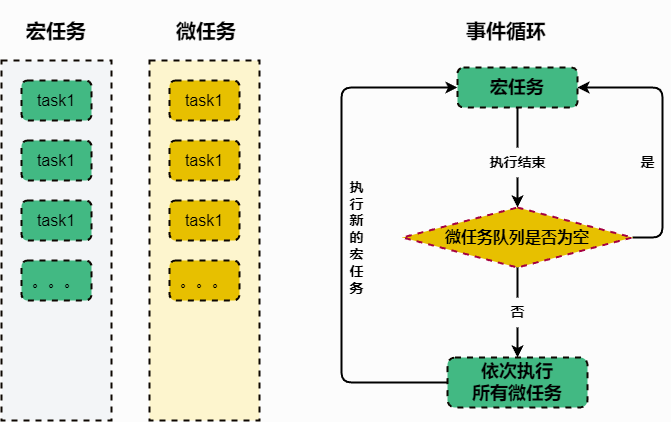

::: info 事件循环

- ==Web 浏览器环境中==：事件循环负责处理**用户交互事件（如点击、滚动等）**、**网络请求**、**计时器**、**定时器**、**其他异步操作（Promise 等）** 等。
- ==Node.js 环境中==：事件循环负责处理**I/O 操作**、**网络请求** 等异步任务。

:::

## 一、事件循环

事件循环是 JavaScript 运行时环境中用来处理 ==异步事件== 的机制。它是实现 JavaScript 的单线程执行模型的核心部分。

事件循环的执行过程是 ==一个不断重复的循环==。每次循环被称为一个"==tick=="。在每个 tick 中，事件循环会首先检查是否有待处理的异步事件。如果有，它们会被添加到 ==事件队列== 中。然后，事件循环会从事件队列中取出一个事件，并且执行对应的回调函数。执行完毕后，如果事件队列中还有待处理的事件，继续取出并执行。

**这个过程不断重复，直到事件队列为空**。

::: info 步骤详解

1. 在执行栈中执行一个宏任务。
2. 执行过程中遇到微任务，将微任务添加到微任务队列中。
3. 当前宏任务执行完毕，立即执行微任务队列中的任务。
4. 当前微任务队列中的任务执行完毕，检查渲染，GUI 线程接管渲染。
5. 渲染完毕后，js 线程接管，执行下一次宏任务（事件队列中取）。

至此完成一次事件循环
:::

**事件循环图解**



这个执行模型保证了 JavaScript 代码的单线程执行，避免了多线程编程带来的竞态条件和资源共享问题。同时，通过异步事件和回调函数的机制，JavaScript 可以处理非阻塞的 I/O 操作和其他异步任务。

理解事件循环对于编写高效和可靠的异步 JavaScript 代码非常重要。它提供了一个清晰的执行模型，帮助开发者理解异步代码的执行顺序和行为。

## 四、代码模拟

使用代码模拟事件循环的执行过程。

```js
// 执行器
class Execution {
  // 接收一段javascript代码作为参数
  constructor(code) {
    this.code = code;
    this.macroTaskQueue = [];
    this.microTaskQueue = [];
  }

  // 启动执行
  exec() {
    // 首次运行，将 传入的 code 推入到 Track中执行
    // 并获取其中的 宏任务和 微任务
    const { macroTaskQueue, microTaskQueue } = this.run(this.code);
    // 将宏任务和微任务 推入到 各自的 队列中
    this.macroTaskQueue.push(...macroTaskQueue);
    this.microTaskQueue.push(...microTaskQueue);
    // 开始执行微任务
    this.runMicroTaskQueue();
  }

  // 执行微任务队列
  runMicroTaskQueue() {
    // 遍历 微任务队列中的所有任务
    // 当当前的 微任务队列清空时，遍历才结束
    while (this.microTaskQueue.length) {
      // 取出 队首的微任务
      const task = this.microTaskQueue.shift();
      // 将 当前微任务 推入到 执行栈中执行
      // 并将返回的 宏任务和微任务 继续 推入到 各自的队列中
      const { macroTaskQueue, microTaskQueue } = this.run(task);
      this.macroTaskQueue.push(...macroTaskQueue);
      this.microTaskQueue.push(...microTaskQueue);
    }
    // 当前微任务执行完毕，继续执行宏任务
    this.runMacroTaskQueue();
  }

  // 执行宏任务队列
  runMacroTaskQueue() {
    // 从 宏任务队列队首 取出一个 宏任务
    const task = this.macroTaskQueue.shift();
    // 将当前 宏任务 推入到 执行栈中执行
    // 并将返回的 宏任务和微任务 继续 推入到 各自的队列中
    const { macroTaskQueue, microTaskQueue } = this.run(task);
    this.macroTaskQueue.push(...macroTaskQueue);
    this.microTaskQueue.push(...microTaskQueue);
    // 再一次执行 微任务队列中的任务
    this.runMicroTaskQueue();
  }

  // 执行栈调用
  run(task) {
    // track 函数表示 执行栈
    // 执行完毕返回 产生的 微任务队列 和 宏任务队列
    const { macroTaskQueue, microTaskQueue } = track(task);
    return { macroTaskQueue, microTaskQueue };
  }
}
const execute = new Execution(scriptCode);
execute.exec();
```

## 五、例子

```js :collapsed-lines
//主线程开始执行
console.log("1");
setTimeout(function () {
  console.log("2");
  process.nextTick(function () {
    console.log("3");
  });
});
new Promise(function (resolve) {
  console.log("4");
  resolve();
}).then(function () {
  console.log("5");
});

process.nextTick(function () {
  console.log("6");
});

new Promise(function (resolve) {
  console.log("7");
  resolve();
}).then(function () {
  console.log("8");
});

//丢到宏事件队列中
setTimeout(function () {
  console.log("9");
  process.nextTick(function () {
    console.log("10");
  });
  new Promise(function (resolve) {
    console.log("11");
    resolve();
  }).then(function () {
    console.log("12");
  });
});

console.log("13");
```

输出结果

```console
1 4 7 13 6 5 8 2 3 9 11 10 12
```
