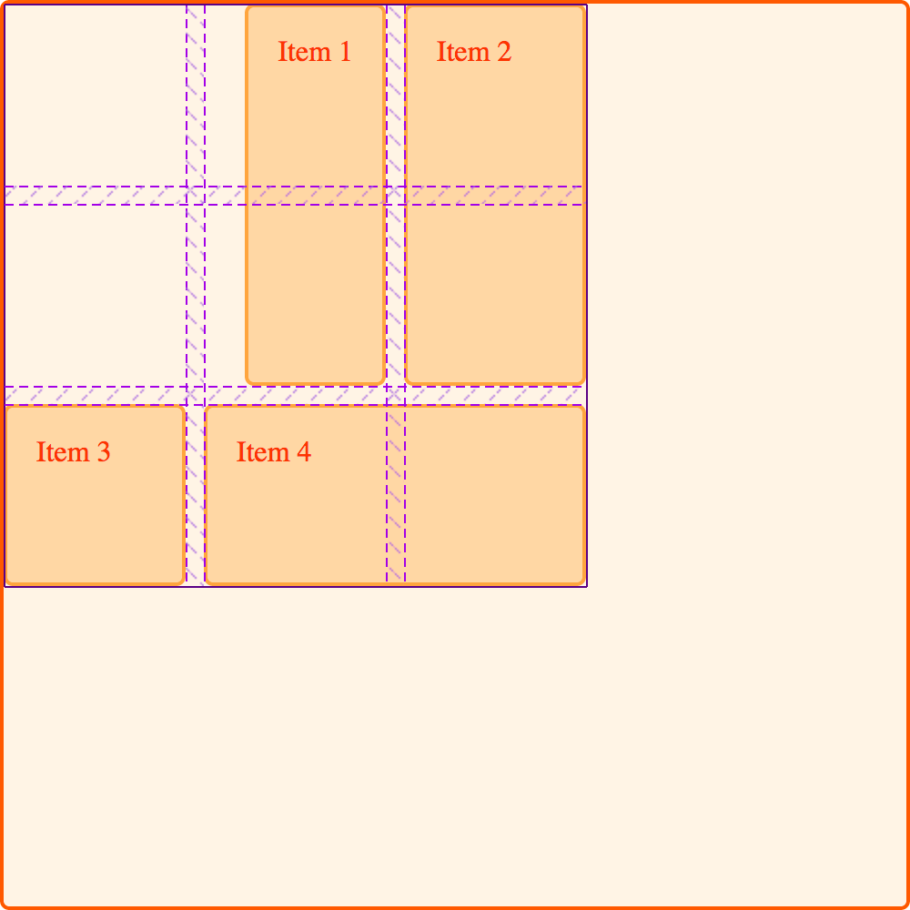

## 一、网格布局的两条轴线

网格布局方式下共有两条轴线用于对齐：块轴和行轴（内联轴）。

块方向的轴是采用块布局时块的排列方向。假设页面中有两个段落，其中一个显示在另一个下面，所以这个方向的轴被称为块轴。

行轴与块方向的轴垂直，它的方向和常规内联流中的文本方向一致。

我们可以把网格区域中的内容，以及网格轨道整体与这两条轴线对齐。

## 二、沿块轴（Block Axis）对齐

属性 `align-self` 和 `align-items` 用于控制元素在块方向的轴上对齐，通过设置这两个属性，可以改变网格区域中的元素的对齐方式。

### 1、使用 align-items

在下面的示例中，网格中包含四个网格区域，可以通过网格容器上的 `align-items` 属性，把元素的对齐方式设置为下列值之一：`auto`、`normal`、`start`、`end`、`center`、`stretch`、`baseline`、`first baseline`、`last baseline`。

设置了 `align-items` 属性，就相当于为网格的所有子元素都设置了 `align-self` 属性，当然也可以为单独的某一个网格元素设置它的个性化的 `align-self` 属性。

::: tip 注意
注意，一旦设置了 `align-items: start`，每个子元素——`
` 的高度将由 `
` 中的内容决定。这与省略 [`align-items`](https://developer.mozilla.org/zh-CN/docs/Web/CSS/align-items)（会将每个 `
` 的高度会被拉伸到网格区域的高度）完全相反。
:::

### 2、使用 align-self

下一个示例演示了将 `align-self` 设置为不同的值的对齐效果。

- 第一个区域的 `align-self` 采用默认值即 `stretch`;
- 第二个元素的 `align-self` 的值为 `start`
- 第三个元素的值为 `end`
- 第四个元素的值为 `center`。

@[demo vue](./demo/demo3.vue)

::: tip 具有固定宽高比的元素

规范中对 `align-self` 的默认行为是拉伸（`stretch`），例外的情况是若元素具有固定宽高比，行为就改为与轴起点对齐（`start`）。此项例外的原因在于，如果把一个有固定宽高比的元素拉伸，将导致它扭曲变形。

虽然规范中已经阐明如何处理，但部分浏览器目前还没有按规范正确地实现，在此特性尚未被完全支持时，为了确保网格中的元素比如图片不被拉伸，可以通过把 `align-self` 和 `justify-self` 都设置为 `start` 来模拟正确的实现效果。
:::

## 三、对齐元素到行轴（Inline Axis）

与 `align-items` 和 `align-self` 用于对齐元素到块轴类似，`justify-items` 和 `justify-self` 用于对齐元素到行轴，可选值也和 `align-self` 一样：`auto`、`normal`、`start`、`end`、`center`、`stretch`、`baseline`、`first baseline`、`last baseline`。

借用上面演示过的设置 `align-items` 的示例，下面把它改为设置 `justify-self` 属性。

默认的对齐方式仍然是 `stretch`，除非元素具有固定宽高比。也就是说在默认情况下，网格元素会覆盖网格区域，除非改变它们的对齐方式。下面的例子中，第一个元素演示了默认的对齐效果：

@[demo vue](./demo/demo4.vue)

与 `align-self` 和 `align-items` 的关系类似，通过为网格容器设置 `justify-items` 属性，就相当于为所有的元素都设置了 `justify-self` 属性。

属性 `justify-self` 和 `justify-items` 在弹性盒布局中未被实现，这是因为弹性盒布局本质上是一维的，在轴上会有多个元素，无法单独对齐其中某一个元素。要在弹性盒布局中实现沿主轴（即行轴）上对齐元素，可以使用 `justify-content` 属性。

### 属性简写

`place-items` 属性是对 `align-items` 和 `justify-items` 的简写。

`place-self` 属性是对 `align-self` 和 `justify-self` 的简写。

## 四、居中对齐

通过组合使用 align 和 justify 属性，让元素居于网格区域的正中就变得非常容易了。

@[demo vue](./demo/demo5.vue)

## 五、对齐网格轨道到块轴

设想这样一种场景，网格轨道整体占据的空间小于网格容器，那么就可以在容器中对齐网格轨道。针对块轴和行轴，分别使用 `align-content` 对齐到块轴，使用 `justify-content` 对齐到行轴。

::: tip 注意

`place-content` 属性则是对 `align-content` 和 `justify-content` 的简写。

:::

属性 `align-content`、`justify-content` 和 `place-content` 的可选值都是： `normal`、`start`、`end`、`center`、`stretch`、`space-around`、`space-between`、`space-evenly`、`baseline`、`first baseline`、`last baseline`。

下面的示例中，网格容器的宽高都是 500 像素，分别定义了行轨道和列轨道各 3 条，轨道尺寸为 100 像素，轨道间隙为 10 像素。可知，网格容器的块方向和文字方向都留有多余的空间。

属性 `align-content` 要设置在网格容器上，因为它的效果应用在整个网格中。

### 1、默认对齐方式

网格布局中默认的行为是对齐到起点（`start`），所以我们看到网格轨道整体居于网格的左上角，紧挨着起始的网格线：

@[demo vue](./demo/demo6.vue)

### 2、设置 align-content: end

如果把容器中 `align-content` 的值改为 `end`，那么网格轨道整体都会移到贴近块方向轴线的最后一条线：

@[demo vue](./demo/demo7.vue)

### 3、设置 align-content: space-between

也可以为这个属性设置与弹性盒布局方式类似的用于分配空间的值：`space-between`，`space-around` 和 `space-evenly`。比如把 `align-content` 的值改为 `space-between`，观察网格元素在空间中是如何摆放的：

@[demo vue](./demo/demo8.vue)

有必要强调一下，这些与分配空间有关的值会使网格元素变大。如果元素跨越了多于一条轨道，因为轨道的间隙变大了，所以元素也变得更大了。因为精确尺寸的网格较为常用，所以如果你决定使用这些值，一定要确保其中的内容能够适应多出来的空间，或者在使用这些属性值时，把元素的对齐方式设置为对齐到起点（`start`），可能会比设置为拉伸（`stretch`）要好。

下图中的网格使用了 `align-content` 属性，左侧的值为 `start`，右侧的值为 `space-between`。观察 item 1 和 item 2，它们都跨越了两条行轨道，右侧的图因为增加了轨道间隙，所以它们占据的空间变大了：

## 六、对齐网格轨道到行轴

在行轴上使用 `justify-content` 属性可以获得与在块轴上使用 `align-content` 相同的对齐效果。

继续利用上面的示例，设置 `justify-content` 的值为 `space-around`，那些占据超过一列的元素将因此获得额外的空间：

@[demo vue](./demo/demo9.vue)

## 七、对齐和自动外边距

另一个在网格区域内使元素对齐的方法是使用自动外边距。如果你曾经用过把容器的左右外边距都设置为 `auto` 以让页面布局显示在视口中间的方法的话，你肯定知道自动外边距能够消化掉全部的多余空间。当把两侧的外边距都设置为 `auto` 时，块元素就会被挤到中间，多余的空间则被留到两侧。

在下面的例子中，元素 item 1 的左外边距被设置成 `auto`，可以看到内容被推到了区域右侧，因为在为元素的内容分配了空间之后，自动外边距占据了剩余的空间：

@[demo vue](./demo/demo10.vue)

在 `Firefox Grid Highlighter` 中可以清晰地看到元素是如何被对齐的：

## 八、对齐和书写模式

上面所有的例子都是工作在英语这样一种从左到右的语言环境下，这意味着当从物理方向观察时，网格的起始线是在从左上开始的。

CSS 网格布局和盒模型对齐规范是为了解决 CSS 中的书写模式而设计的。这意味着，如果你用一种从右到左的语言工作，比如阿拉伯语，那网格的起始线就应该是从右上开始，此时 `justify-content: start` 也将使网格轨道从网格的右侧开始。

为 `margin-right` 和 `margin-left` 设置自动外边距，或者使用绝对位置如 `top`、`right`、`bottom` 和 `left` 来设置偏移量对书写模式来说并不是一种友好的表达方式。在下一篇文章中，我们会深入讨论 CSS 网格布局、盒模型对齐和书写模式之间的关系，理解这些原理，对于开发用多种语言显示的网站，或者设计混合了多种语言和书写模式的页面将大有益处。
