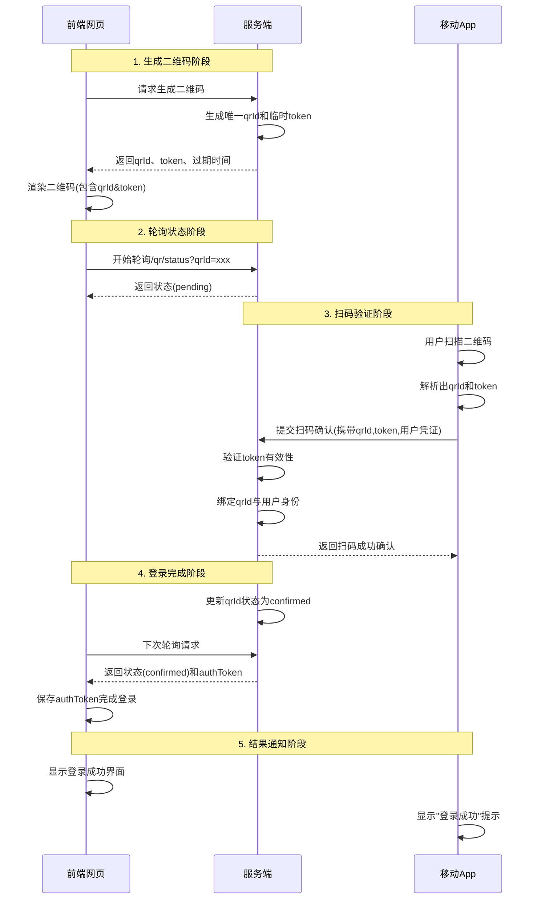

## 业务场景分析

在一些需要用户登录的场景下，比如购物、支付、转账等，传统的用户名密码登录方式已经不再适用。而二维码登录是一种更加安全、方便的登录方式。

一般来说，完整的流程是：

## 前端请求临时 token

前端向后端请求生成临时 token，用于本次登录。后端将 token 生成以后存到数据库或者 redis 缓存。

## 前端生成二维码

前端根据临时 token 生成二维码。

二维码的本质就是点阵图，点阵图的每一个点有两种状态：黑和白。

## 前端轮询登录状态

前端轮询登录状态，即前端定时向后端请求登录状态。

## 完成登录

完成登录，即前端获取到登录凭证。
