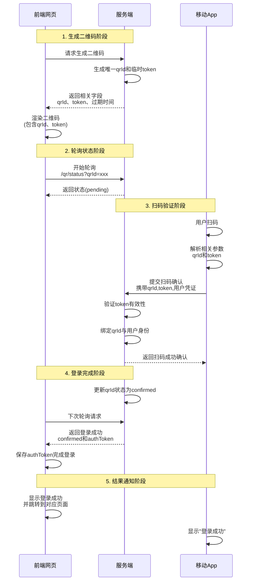
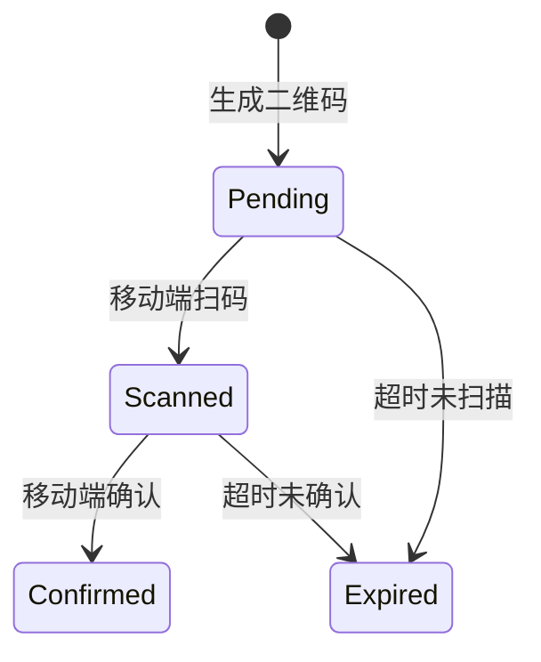

## 业务场景分析

在一些需要用户登录的场景下，比如购物、支付、转账等，传统的用户名密码登录方式已经不再适用。而二维码登录是一种更加安全、方便的登录方式。

一般来说，完整的流程是：



## 要点说明

### 二维码生成阶段

- 服务端生成临时 token 和唯一 qrId（通常有效期 5 分钟）
- 二维码内容需要包含：验证地址，参数需要携带 qrId 和 token
- 二维码的大小、颜色、logo 等根据需求定制

### 二维码的生成方案

二维码一般需要包含一些动态参数，例如：

```bash
https://example.com/login?qrId=abc123&token=xyz456
```

因此我们需要动态生成二维码，一般我们可以选择前端生成，也可以选择服务端生成。

使用前端生成的优势在于：无需服务端额外开销，前端生成更加灵活

::: tip 为什么选择 canvas 方案？
我们一般使用 canvas 去绘制二维码，这是因为二维码需要包含相关参数，二维码需要动态生成。
:::

::: warning 为什么不选择 div+css、SVG 方案？
在绘制二维码这种包含大量小元素的场景，canvas 要比 div+css、svg 性能要好。
:::

- 可以使用第三方库如 qrcode.js、vue-qrcode 等第三方库直接生成二维码

#### 二维码的生成流程

我们可以自己封装一个二维码生成函数，大致流程如下：

1. 分析数据
2. 编码数据
3. 生成纠错码
4. 构建矩阵
5. 应用掩码
6. 渲染结果

### 2、状态轮询机制

```javascript
// 前端轮询示例
const poll = setInterval(async () => {
  const res = await fetch(`/qr/status?qrId=${qrId}`);
  if (res.status === "confirmed") {
    clearInterval(poll);
    handleLogin(res.authToken);
  }
}, 2000);
```

### 3、移动端扫码验证

- App 需已登录状态才能确认
- 安全传输示例：

```java
// Android端请求示例
RequestBody body = new FormBody.Builder()
    .add("qrId", qrId)
    .add("token", token)
    .add("userId", currentUserId)
    .add("sign", generateSign(qrId, token))
    .build();
```

## 状态转换流程



## 安全增强措施

- 每次状态变更都验证 token
- 限制同一 qrId 的确认次数
- 加密传输敏感参数
- 扫码后显示登录设备信息供用户确认

## 异常处理流程

### 1、二维码过期

- 服务端返回`410 Gone`状态码
- 前端自动刷新二维码

### 2、重复确认

- 服务端返回`409 Conflict`
- 移动端提示"已在其他设备登录"

### 3、网络中断

- 前端显示网络中断，提示用户刷新重新
- 移动端提示"网络中断"，稍后重新尝试扫码。

这个时序图完整覆盖了从二维码生成到登录完成的全部过程，实际实现时可根据具体技术栈调整接口设计，但核心状态机逻辑保持一致。
