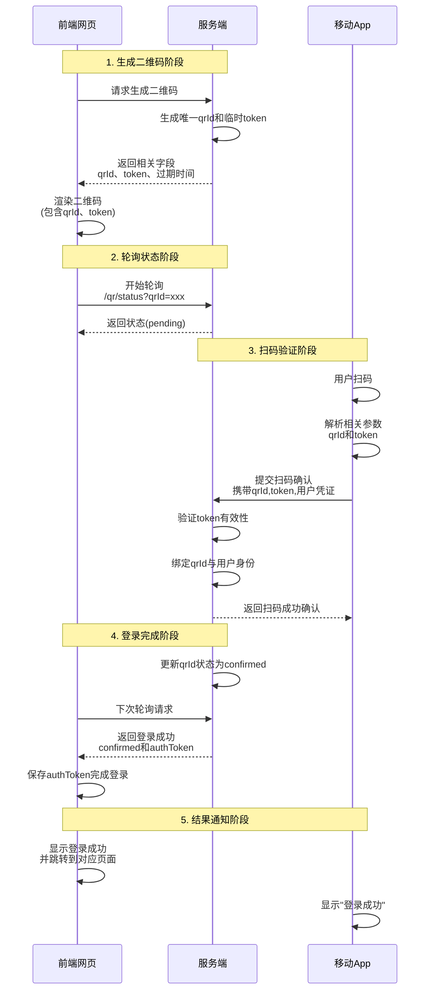
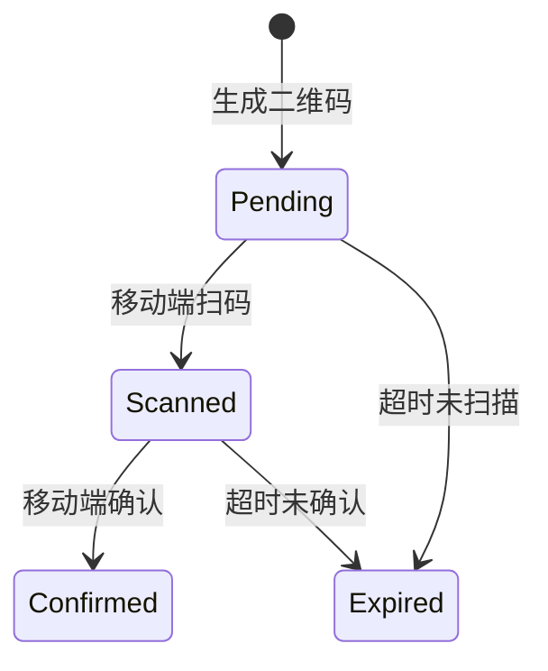

## 业务场景分析

在一些需要用户登录的场景下，比如购物、支付、转账等，传统的用户名密码登录方式已经不再适用。而二维码登录是一种更加安全、方便的登录方式。

一般来说，完整的流程是：



## 要点说明

### 二维码生成阶段

#### 二维码的内容

二维码主要包含以下内容：

- 服务端生成临时 token 和唯一 qrId（通常有效期 5 分钟）
- 二维码内容需要包含：验证地址，参数需要携带 qrId 和 token
- 二维码的大小、颜色、logo 等根据需求定制

例如：

```bash
https://example.com/login?qrId=abc123&token=xyz456
```

#### 前端生成 vs 服务端生成

生成二维码，一般我们可以选择前端生成，也可以选择服务端生成。

使用前端生成的优势在于：无需服务端额外开销，并且前端生成更加灵活

#### Canvas vs SVG vs Div+CSS

前端生成二维码的方案有很多选择：可以使用 canvas 方案，也可以选择 svg 方案，或者是 div+css 方案。

但是一般都选择 canvas 方案，，在绘制二维码这种包含大量小元素的场景:

1. canvas 要比 div+css、svg 性能要好。
   1. canvas 可以直接生成图片。
   2. svg 只能生成 xml 字符串，需要前端额外处理。
   3. div+css 需要遍历生成大量的 dom 元素，内存占用高。
2. canvas 更加灵活。
   1. canvas 修改效果比较简单，直接重新渲染即可
   2. svg 和 div+css 要修改元素内容，得大面积的操作 dom，比较麻烦。

#### 如何实现

##### 使用第三方库

可以使用第三方库如 qrcode.js、vue-qrcode 等第三方库直接生成二维码

##### 自己封装

我们可以自己封装一个二维码生成函数，大致流程如下：

1. 分析数据
2. 编码数据
3. 生成纠错码
4. 构建矩阵
5. 应用掩码
6. 渲染结果

### 请求机制

一般面对这种场景，我们可能考虑以下几种方式：

1. **轮询**：使用 ajax 请求，每间隔几秒请求一次服务端，获取最新的二维码状态。
2. **WebSocket**：使用 WebSocket 建立长连接，主动请求二维码状态，或服务端主动推送二维码状态。
3. **长轮询**：使用 ajax 请求，服务端不返回数据时，会阻塞请求，直到有数据返回。
4. **sse 服务端消息推送**：使用 sse 服务端通知，服务端有数据时主动推送给客户端。

而最主流的解决方案是：**长轮询**。

为什么选择长轮询呢？这主要得从我们主要的技术场景分析，二维码扫描具备以下特点：

- 短期临时行：平均持续的时间比较短，一般 1 分钟左右
- 低频状态变更：只有 未扫描、已扫描并确认中、已确认、超时、已失效 这几个状态变更。

如果使用 ajax 轮询，那么会产生大量的无效请求，严重的浪费了服务端资源。

如果使用 SSE、WebSocket 这种长连接，对服务器的压力比较大。它的持久链接、实时传输、高频次传输的优势无法体现出来。并且如果因为网络问题导致长连接中断，需要重新建立连接，技术实现复杂度较高。

而长轮询的方案，只需要服务端维护一个轮询请求，不需要额外维护长连接，成本较低。

```vue
<script>
export default {
  mounted() {
    Promise.all([this.startLogin()]).then(() => {
      this.generateQrCode();
    })
  },
  methods: {
    // 获取二维码相关的信息
    async startLogin() {
      // 发起ajax请求，获取二维码相关的 qrId、token、过期时间
      const response = await axios.get('/api/qrcode/generate');
      this.generateQrCode(response.data);
    },
    // 二维码生成方法
    generateQrCode(data) {
      // 生成二维码
      new QRCode({
        text: qrCodeUrl, // 要绘制的文本信息
        width: 128, // 像素宽度
        height: 128, // 像素高度
        colorDark: '#000000', // 深色模块的颜色
        colorLight: '#ffffff', // 浅色模块的颜色
        padding: 10, // 二维码周围空白区域的宽度
      }).then((dataUrl) => {
        this.qrCodeUrl = dataUrl; // 将dataUrl 赋值给 canvas
        // 开始长轮询
        this.startPolling();
      })
    },
    startPolling() {
      try {
        // 发起长轮询请求（服务器设置较长超时时间）
        const response = await axios.get('/api/qrcode/check', {
          params: { qrId: this.qrId },
          timeout: 30000 // 30秒超时
        });

        // 更新状态
        this.status = response.data.status;

        // 根据状态决定后续操作
        if (response.data.status === '已扫描') {
          this.status = '已扫描，等待确认';
          this.startPolling(); // 立即发起下一次检查
        }
        else if (response.data.status === '已确认') {
          this.handleLoginSuccess(response.data.token);
        }
        else if (response.data.status === '已过期') {
          this.resetState();
        }
        else {
          // 其他状态继续轮询
          this.pollingInterval = setTimeout(() => {
            this.startPolling();
          }, 1000); // 1秒后重试
        }
      } catch (error) {
        if (axios.isCancel(error)) {
          console.log('请求被取消');
        } else if (error.code === 'ECONNABORTED') {
          // 超时后重新发起请求
          this.pollingInterval = setTimeout(() => {
            this.startPolling();
          }, 1000);
        } else {
          console.error('轮询错误:', error);
          this.status = '连接错误，重试中...';
          this.pollingInterval = setTimeout(() => {
            this.startPolling();
          }, 5000); // 5秒后重试
        }
      }
    },

    handleLoginSuccess(token) {
      console.log('登录成功，token:', token);
      this.status = '登录成功';
      // 存储token，跳转等操作...
      localStorage.setItem('authToken', token);
      this.resetState();
    },

    stopPolling() {
      if (this.pollingInterval) {
        clearTimeout(this.pollingInterval);
        this.pollingInterval = null;
      }
      this.resetState();
    },

    resetState() {
      this.qrCodeUrl = '';
      this.qrId = null;
      this.status = '未开始';
    }
  },
  beforeUnmount() {
    // 组件卸载时清除轮询
    this.stopPolling();
  }
};
</script>
```

### 3、移动端扫码验证

- App 需已登录状态才能确认
- 安全传输示例：

```java
// Android端请求示例
RequestBody body = new FormBody.Builder()
    .add("qrId", qrId)
    .add("token", token)
    .add("userId", currentUserId)
    .add("sign", generateSign(qrId, token))
    .build();
```

## 状态转换流程



## 安全增强措施

- 每次状态变更都验证 token
- 限制同一 qrId 的确认次数
- 加密传输敏感参数
- 扫码后显示登录设备信息供用户确认

## 异常处理流程

### 1、二维码过期

- 服务端返回`410 Gone`状态码
- 前端自动刷新二维码

### 2、重复确认

- 服务端返回`409 Conflict`
- 移动端提示"已在其他设备登录"

### 3、网络中断

- 前端显示网络中断，提示用户刷新重新
- 移动端提示"网络中断"，稍后重新尝试扫码。

这个时序图完整覆盖了从二维码生成到登录完成的全部过程，实际实现时可根据具体技术栈调整接口设计，但核心状态机逻辑保持一致。
