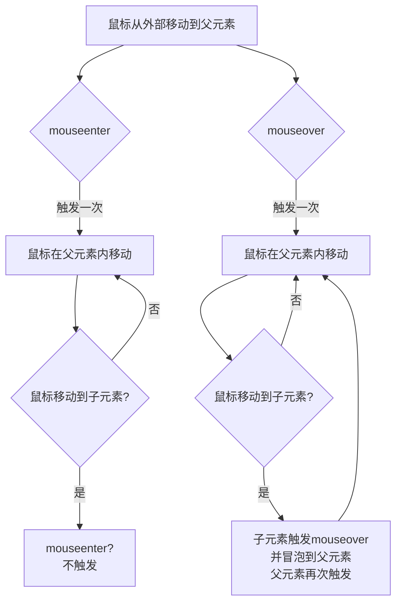

`mouseenter` 和 `mouseover` 最核心的区别就在于 **事件冒泡** 和 **对子元素的态度**。

### 核心区别总结

| 特性             | mouseenter   | mouseover    |
| ---------------- | ------------ | ------------ |
| 冒泡             | 不冒泡       | 会冒泡       |
| 进入子元素的触发 | 不触发       | 会触发       |
| 事件流           | 更简单、纯净 | 更频繁、复杂 |

### 详细解释和示例

假设我们有如下 HTML 结构：

```html
<div id="outer">
  外部区域
  <div id="inner">内部区域</div>
</div>
<p id="log"></p>
```

#### 场景一：使用 `mouseover`（会冒泡）

```javascript
const outer = document.getElementById("outer");
const inner = document.getElementById("inner");
const log = document.getElementById("log");

outer.addEventListener("mouseover", () => {
  log.textContent += "outer 被触发了！";
});
```

**会发生什么？**

1. 当鼠标从页面外部**首次进入** `#outer` 区域时，触发一次事件。
2. 当鼠标从 `#outer` 区域**移动进入** `#inner` 区域时，因为 `#inner` 是 `#outer` 的子元素，鼠标仍然在 `#outer` 内部。但 `mouseover` 事件会在 `#inner` 上触发，并且**这个事件会冒泡**到父元素 `#outer`。
3. 因此，`#outer` 的监听器会**再次被触发**。

**结果：** 仅仅是从外部进入内部，`outer 被触发了！` 这条日志可能会出现多次，这通常不是我们想要的行为。

#### 场景二：使用 `mouseenter`（不冒泡）

```javascript
const outer = document.getElementById("outer");
const inner = document.getElementById("inner");
const log = document.getElementById("log");

outer.addEventListener("mouseenter", () => {
  log.textContent += "outer 被触发了！";
});
```

**会发生什么？**

1. 当鼠标从页面外部**首次进入** `#outer` 区域时，触发一次事件。
2. 当鼠标在 `#outer` 内部移动，**即使进入子元素 `#inner`**，`mouseenter` 事件也**不会再次触发**。因为它只关心鼠标是否进入了该元素本身的边界，不关心其子元素。

**结果：** `outer 被触发了！` 这条日志只会在鼠标真正从外部进入 `#outer` 时记录一次，行为非常清晰。

### 可视化过程

下图清晰地展示了两者在鼠标移动时的区别：



### 如何选择？

- **使用 `mouseenter` (通常与 `mouseleave` 配对)**

  - 当你只想在鼠标**进入或离开一个元素本身（不包括其子元素）** 时执行操作。
  - **典型场景**：鼠标悬停在一个导航项上显示下拉菜单。你希望鼠标在下拉菜单（子元素）内移动时，导航项依然保持“悬停”状态。使用 `mouseenter/mouseleave` 可以轻松实现，而无需担心子元素干扰。

- **使用 `mouseover` (通常与 `mouseout` 配对)**
  - 当你需要更细粒度的控制，或者**确实需要监听元素内部子元素上的鼠标进入事件**。
  - 常用于需要事件委托的场景，或者需要知道鼠标在元素内部精确移动的情况。

### 总结

简单来说：

- 把 `mouseenter` 想象成进入一个**房子**。一旦你进了门，在房子里的哪个房间（子元素）走动，都算是在这个房子里。只有你真正走出大门，才算 `mouseleave`。
- 把 `mouseover` 想象成进入一个**房子的每个房间**。从大门进入客厅会触发一次，从客厅走进卧室又会触发一次（因为卧室也是房子的一部分）。

因此，在大多数需要实现悬停效果的场景下，**`mouseenter` 和 `mouseleave` 是更安全、更直观的选择**。
