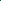

## 1、`color()` 颜色转换

解析颜色值，将表示颜色的字符串转换为颜色对象。

### 语法

```less
color(string);
```

- `string`: 一个字符串，表示指定的颜色。

### 例子

```less
color("#aaa"); // '#aaa'
```

## 2、`image-size()` 获取图片尺寸

根据文件获取图片尺寸。

### 语法

```less
image-size(string);
```

- `string`: 一个字符串，表示指定的文件。

### 例子

```less
image-size("file.png"); // '10px 10px'
```

::: tip
此函数需要在每个环境中实现。目前仅在 `node` 环境中可用。
:::

## 3、`image-height()` 获取图片高度

根据文件获取图片高度。

### 语法

```less
image-height(string);
```

- `string`: 一个字符串，表示指定的文件。

### 例子

```less
image-height("file.png"); // '10px'
```

::: tip
此函数需要在每个环境中实现。目前仅在 `node` 环境中可用。
:::

## 4、`image-width()` 获取图片宽度

根据文件获取图片宽度。

### 语法

```less
image-width(string);
```

- `string`: 一个字符串，表示指定的文件。

### 例子

```less
image-width("file.png"); // '10px'
```

::: tip
此函数需要在每个环境中实现。目前仅在 `node` 环境中可用。
:::

## 5、`convert()` 转换单位

将一个数字从一个单位转换为另一个单位。

### 语法

```less
convert(number, identifier, string, escaped value);
```

- `number`: 一个浮点数，带有单位。
- `identifier`, `string` or `escaped value`: 单位

::: info
第一个参数包含带单位的数字，第二个参数包含目标单位。如果单位兼容，则数字会被转换。如果不兼容，则第一个参数会原样返回。以下按组为==可转换==的单位：

- 长度单位: `m`, `cm`, `mm`, `in`, `pt` 和 `pc`,
- 时间单位: `s` 和 `ms`,
- 角度单位: `rad`, `deg`, `grad` 和 `turn`.

:::

### 例子

```less
convert(9s, "ms"); // 9000ms
convert(14cm, mm); // 140mm
convert(8, mm); // 8 // incompatible unit types
```

## 6、`data-uri()` 内联资源

内联一个资源并在 `ieCompat` 选项开启时，在资源过大或使用函数在浏览器中时回退到 `url()`。如果没有提供 MIME 类型，则 node 使用 `mime` 包来确定正确的 MIME 类型。

### 语法

```less
data-uri(mimetype, url);
```

- `mimetype`: (Optional) A MIME type string.
- `url`: The URL of the file to inline.

如果没有提供 MIME 类型，data-uri 函数会根据文件后缀名猜测类型。文本和 SVG 文件使用 utf-8 编码，其他文件则使用 base64 编码。

如果用户提供了 MIME 类型，当参数以 `;base64` 结尾时（例如 `image/jpeg;base64`），函数会使用 base64 编码；否则（如 `text/html`）使用 utf-8 编码。

### 例子

```less
data-uri('../data/image.jpg');
data-uri('image/jpeg;base64', '../data/image.jpg');
data-uri('image/svg+xml;charset=UTF-8', 'image.svg');
```

输出：

```css
url('data:image/jpeg;base64,bm90IGFjdHVhbGx5IGEganBlZyBmaWxlCg==');
url('data:image/jpeg;base64,bm90IGFjdHVhbGx5IGEganBlZyBmaWxlCg==');
url("data:image/svg+xml;charset=UTF-8,%3Csvg%3E%3Ccircle%20r%3D%229%22%2F%3E%3C%2Fsvg%3E");
```

## 7、`unit()` 单位操作

移除或更改一个维度的单位。

### 语法

```less
unit(number, unit);
```

- `number`: 一个数字，带或者不带单位。
- `unit`: 要更改的单位。如果省略，会移除单位。

### 例子

```less
unit(5, px); // 5px
unit(5em); // 5
unit(9s, "ms"); // 9000ms
unit(14cm, mm); // 140mm
unit(8, mm); // 8 // incompatible unit types
```

## 8、`get-unit()` 获取单位

返回一个数字的单位。如果参数包含单位，则返回该单位。如果参数不包含单位，则返回空值。

### 语法

```less
get-unit(number);
```

- `number`: 一个数字，带或者不带单位。

### 例子

```less
get-unit(5px); // 'px'
get-unit(5); // //nothing
```

## 9、`svg-gradient()` 生成渐变

生成多色 SVG 渐变。

`svg-gradient`函数用于生成多色 SVG 渐变。它必须至少包含三个参数：第一个参数指定渐变类型和方向，其余参数列出颜色及其位置。第一个和最后一个指定颜色的位置是可选的，其余颜色必须指定位置。

方向必须是以下值之一：`to bottom`（向下）、`to right`（向右）、`to bottom right`（向右下）、`to top right`（向右上）、`ellipse`（椭圆）或 `ellipse at center`（中心椭圆）。方向可以指定为转义值 `~'to bottom'` 或空格分隔的单词 `to bottom`。

方向参数后必须跟随两个或更多颜色停止点。颜色停止点可以放在一个列表中提供，也可以分别作为单独参数指定。

参数 - 颜色停止点（列表形式）:

- `escaped value` 或 `list of identifiers`: 方向
- `list` - 包含所有颜色及其位置的列表

参数 - 颜色停止点（单独参数形式）:

- `escaped value` 或 `list of identifiers`: 方向
- `color [percentage]` : 第一个颜色及其相对位置（位置可选）
- `color [percentage]` : (可选) 第二个颜色及其相对位置
- ...
- `color [percentage]` : (可选) 第 n 个颜色及其相对位置
- `color [percentage]` : 最后一个颜色及其相对位置（位置可选）

返回值: 返回一个包含"URI 编码"的 SVG 渐变的`url`。

### 例子

```less
div {
  @list: red, green 30%, blue;
  background-image: svg-gradient(to right, @list);
}
```

等价写法 - 颜色停止点作为单独参数:

```less
div {
  background-image: svg-gradient(to right, red, green 30%, blue);
}
```

编译后:

```css
div {
  background-image: url("data:image/svg+xml,%3C%3Fxml%20version%3D%221.0%22%20%3F%3E%3Csvg%20xmlns%3D%22http%3A%2F%2Fwww.w3.org%2F2000%2Fsvg%22%20version%3D%221.1%22%20width%3D%22100%25%22%20height%3D%22100%25%22%20viewBox%3D%220%200%201%201%22%20preserveAspectRatio%3D%22none%22%3E%3ClinearGradient%20id%3D%22gradient%22%20gradientUnits%3D%22userSpaceOnUse%22%20x1%3D%220%25%22%20y1%3D%220%25%22%20x2%3D%22100%25%22%20y2%3D%220%25%22%3E%3Cstop%20offset%3D%220%25%22%20stop-color%3D%22%23ff0000%22%2F%3E%3Cstop%20offset%3D%2230%25%22%20stop-color%3D%22%23008000%22%2F%3E%3Cstop%20offset%3D%22100%25%22%20stop-color%3D%22%230000ff%22%2F%3E%3C%2FlinearGradient%3E%3Crect%20x%3D%220%22%20y%3D%220%22%20width%3D%221%22%20height%3D%221%22%20fill%3D%22url(%23gradient)%22%20%2F%3E%3C%2Fsvg%3E");
}
```

注意：在 2.2.0 之前的版本中，结果是`base64`编码的。

生成的背景图像左侧为红色，30%宽度处为绿色，最后以蓝色结束。Base64 编码部分包含以下 svg 渐变：



```xml
<?xml version="1.0" ?>
<svg xmlns="http://www.w3.org/2000/svg" version="1.1" width="100%" height="100%" viewBox="0 0 1 1" preserveAspectRatio="none">
    <linearGradient id="gradient" gradientUnits="userSpaceOnUse" x1="0%" y1="0%" x2="100%" y2="0%">
        <stop offset="0%" stop-color="#ff0000"/>
        <stop offset="30%" stop-color="#008000"/>
        <stop offset="100%" stop-color="#0000ff"/>
    </linearGradient>
    <rect x="0" y="0" width="1" height="1" fill="url(#gradient)" />
</svg>
```
