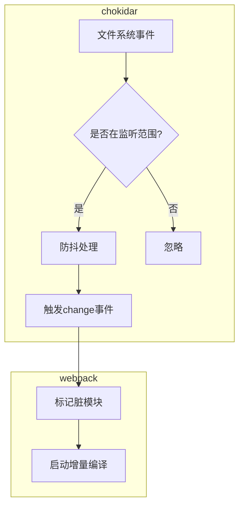

chokidar 是 Node.js 生态中**高性能的文件监听库**，专为解决原生 fs.watch 的缺陷而设计，被 `webpack-dev-server` 和 `webpack --watch` 用作底层文件系统监听工具。

## chokidar 的核心优势

chokidar 提供了以下核心优势：

1. 跨平台兼容性：chokidar 封装了各操作系统的原生文件事件

   - Node.js 的`fs.watch`
   - Linux 的`inotify`
   - macOS 的 `FSEvents`
   - Windows 的 `ReadDirectoryChangesW`

2. 防抖聚合：通过 `aggregateTimeout` 合并快速连续的`add`、`change` 等事件

3. 忽略规则：支持 `ignored` 配置过滤 `node_modules` 等目录

## Webpack 中的集成方式

### 1、在 `webpack-dev-server` 中的使用

```javascript
// webpack-dev-server 内部实现简化
const chokidar = require("chokidar");

class Server {
  setupWatchFiles() {
    this.watcher = chokidar.watch(
      [this.options.contentBase, path.resolve("src")],
      {
        ignored: /node_modules/,
        ignoreInitial: true,
        awaitWriteFinish: {
          stabilityThreshold: 300, // 文件写入稳定后再触发
        },
      }
    );

    this.watcher.on("change", (filePath) => {
      this.sockWrite("content-changed"); // 通知浏览器刷新
    });
  }
}
```

### 2、在 `webpack --watch` 中的使用

Webpack 直接通过 `watchpack`（基于 chokidar 的封装）监听文件：

```javascript
// webpack/lib/Watching.js
const Watchpack = require("watchpack");

this.watcher = new Watchpack({
  aggregateTimeout: 200, // 防抖延迟
  poll: true, // 备用轮询机制
});
```

## 关键配置参数

通过 `webpack.config.js` 的 `watchOptions` 透传 chokidar 配置：

```javascript
module.exports = {
  watchOptions: {
    aggregateTimeout: 300, // 防抖延迟（毫秒）
    ignored: /node_modules/,
    poll: 1000, // 轮询间隔（兼容虚拟文件系统）
    followSymlinks: false, // 不追踪软链接
  },
};
```

| **参数**           | **作用**                            | **推荐值**       |
| ------------------ | ----------------------------------- | ---------------- |
| `aggregateTimeout` | 合并连续事件的延迟时间              | 200-500ms        |
| `ignored`          | 忽略监听的文件/目录（正则或函数）   | `/node_modules/` |
| `poll`             | 备用轮询模式（兼容 Docker/NFS）     | 1000（1 秒）     |
| `atomic`           | 处理原子写入（如 Vim 的 swap 文件） | true             |

## 性能优化

### 1、减少监听范围

将一些不需要监听但又可能触发变更的文件或目录添加到 `ignored` 中，如依赖包、构建输出目录、临时文件等。

```javascript
watchOptions: {
  ignored: [/node_modules/, /\.git/, path.resolve(__dirname, "temp")];
}
```

### 2、虚拟文件系统适配

```javascript
watchOptions: {
  poll: process.env.NODE_ENV === "docker" ? 500 : false;
}
```

### 3、自定义事件处理

通过插件扩展监听逻辑：

```javascript
compiler.hooks.watchRun.tap("MyPlugin", (compiler) => {
  const changedFiles = compiler.modifiedFiles; // 获取变更文件
});
```

## 常见问题

### 1、文件变更未触发编译

#### 检查点

- 确认文件路径未被 `ignored` 规则排除
- 尝试启用 `poll: 1000` 排除原生事件失效问题
- 检查文件权限（特别是 Docker 挂载卷）

### 2、CPU 占用过高

#### 优化方案

```javascript
watchOptions: {
  ignored: [
    /[\\/]\.next/, // Next.js 构建目录
    /.*\.log$/, // 日志文件
    (path) => path.includes("__tests__"),
  ];
}
```

### 3、符号链接问题

```javascript
watchOptions: {
  followSymlinks: false; // 避免监听符号链接指向的外部目录
}
```

## 底层原理图示



## 扩展应用场景

### 1、自定义开发工具

```javascript
const watcher = chokidar.watch("src/**/*.md", {
  persistent: true,
});

watcher.on("change", (path) => {
  console.log(`Markdown文件更新: ${path}`);
  // 触发自定义处理逻辑
});
```

### 2、与 Vite/Rollup 集成

虽然 Vite 使用 `fs.watch` 直接监听，但可通过插件扩展：

```javascript
import chokidar from "chokidar";

export default {
  plugins: [
    {
      configureServer(server) {
        chokidar.watch("config/*.json").on("change", () => {
          server.ws.send("config-changed");
        });
      },
    },
  ],
};
```

## 总结

chokidar 作为 Webpack 文件监听的基石，其正确配置直接影响：

- **HMR 响应速度**（通过 `aggregateTimeout` 平衡实时性与性能）
- **系统资源占用**（合理的 `ignored` 规则可降低 CPU/内存消耗）
- **开发体验稳定性**（解决虚拟环境下的监听失效问题）

掌握其原理后，可针对不同开发环境（如 Docker、WSL2）进行精准调优。
