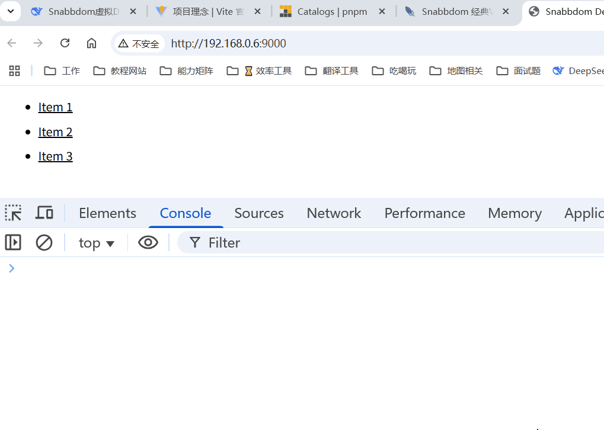

## 什么是 Snabbdom？

Snabbdom 是一个轻量级、高性能的虚拟 DOM 库，专注于提供简洁的 API 和极致的渲染性能。它的核心代码仅约 200 行（SLOC），但功能强大，适合构建动态 UI 或需要频繁更新的应用。

### 核心特点

- 极简高效：体积小（核心代码精简），虚拟 DOM Diff 算法优化，性能接近原生 DOM 操作。
- 模块化设计：通过插件扩展功能（如 class、style、eventlisteners 等）。
- 无框架绑定：不强制使用特定架构，可与任何技术栈结合（如原生 JS、TypeScript）。
- 函数式风格：视图通过纯函数声明，数据驱动更新。

### 核心 API

- `h(tag, data, children)`：创建虚拟节点（VNode）
- `init(modules)`：初始化 Snabbdom，返回 patch 函数
- `patch(oldVNode, newVNode)`：对比并更新 DOM

## 搭建项目准备环境

我们可以使用 webpack 环境来搭建一个项目使用案例，便于后续的学习。

### 项目安装

```bash
## 项目目录
mkdir snabbdom-demo && cd snabbdom-demo
## 初始化依赖
pnpm init -y
## 安装依赖包
pnpm add snabbdom webpack webpack-cli webpack-dev-server html-webpack-plugin
```

### 项目结构

:::file-tree

- snabbdom-demo
  - node_modules/
  - src
    - index.js
  - webpack.config.js
  - package.json
  - index.html
  - pnpm-lock.yaml
  - package-lock.json

:::

### 关键代码

拷贝下述代码到对应的文件里，后边我们会详细讲解

::::code-tabs
@tab webpack.config.js

```js :collapsed-lines=10
const path = require("path");
const HtmlWebpackPlugin = require("html-webpack-plugin");

module.exports = {
  mode: "development",
  entry: "./src/index.js",
  output: {
    path: path.resolve(__dirname, "dist"),
    filename: "bundle.js",
    clean: true,
  },
  devServer: {
    static: {
      directory: path.join(__dirname, "dist"),
    },
    compress: true,
    liveReload: true,
    port: 9000,
    hot: true,
  },
  plugins: [
    new HtmlWebpackPlugin({
      template: "./index.html",
    }),
  ],
};
```

@tab index.js

```js :collapsed-lines=10
import {
  init,
  classModule,
  propsModule,
  styleModule,
  eventListenersModule,
  h,
} from "snabbdom";

// 通过传入模块初始化 patch 函数
const patch = init([
  classModule, // 开启 classes 功能
  propsModule, // 支持传入 props
  styleModule, // 支持内联样式同时支持动画
  eventListenersModule, // 添加事件监听
]);

const container = document.getElementById("container");
console.log(container);

const vnode1 = h("div#container.two.classes", { on: { click: someFn } }, [
  h("span", { style: { fontWeight: "bold" } }, "This is bold"),
  " and this is just normal text",
  h("a", { props: { href: "/foo" } }, "I'll take you places!"),
]);
console.log(vnode1);
// 传入一个空的元素节点 - 将产生副作用（修改该节点）
patch(container, vnode1);

const vnode2 = h(
  "div#container.two.classes",
  { on: { click: anotherEventHandler } },
  [
    h(
      "span",
      { style: { fontWeight: "normal", fontStyle: "italic" } },
      "This is now italic type"
    ),
    " and this is still just normal text",
    h("a", { props: { href: "/bar" } }, "I'll take you places!"),
  ]
);
console.log(vnode2);

// 再次调用 `patch`
patch(vnode1, vnode2); // 将旧节点更新为新节点

function someFn() {
  console.clear();
  console.log("someFn");
  console.log(...arguments);
}
function anotherEventHandler() {
  console.clear();
  console.log("anotherEventHandler");
  console.log(...arguments);
}
```

@tab index.html

```html :collapsed-lines=10
<!DOCTYPE html>
<html lang="en">
  <head>
    <meta charset="UTF-8" />
    <title>Snabbdom Demo</title>
  </head>
  <body>
    <!--[!code highlight]-->
    <div id="container"></div>
  </body>
</html>
```

@tab package.json

```json :collapsed-lines=10
{
  "name": "snabbdom",
  "version": "1.0.0",
  "description": "",
  "main": "index.js",
  "scripts": {
    "dev": "webpack-dev-server" // [!code highlight]
  },
  "keywords": [],
  "author": "",
  "license": "ISC",
  "packageManager": "pnpm@10.12.4",
  "dependencies": {
    "html-webpack-plugin": "^5.6.3",
    "snabbdom": "^3.6.2",
    "webpack": "^5.99.9",
    "webpack-cli": "^6.0.1",
    "webpack-dev-server": "^5.2.2"
  }
}
```

::::

### 启动项目

我们需要在项目根目录下执行以下命令来启动项目：

```bash
pnpm run dev
```

## 基础入门

### 了解一下核心 API

首先我们先了解一下核心 API 的使用：

#### 1、`h(tag, data, children)`：创建虚拟节点（VNode）

##### 参数说明

- `tag`：标签名或选择器字符串。
- `data`：
  - `props`：自定义属性对象，如 `{ id: "myDiv" }`。
  - `class`：类名对象或字符串。
  - `style`：内联样式对象或字符串。
  - `on`：事件监听器对象，如 `{ click: handler }`。
  - `attrs`：css 属性对象，如 `{ id: "myDiv" }`。
  - `key`：唯一标识符，用于 Diff 算法。
  - 其它参数如：`is`、`dataset`、`hooks` 等。
- `children`：子节点数组或字符串。

##### 示例

```javascript
h("div", { class: { active: true } }, "Hello Snabbdom");
```

#### 2、`init(modules)`：初始化 Snabbdom，返回 patch 函数

##### 参数说明

- `modules`：包含模块的数组，如 `[classModule, styleModule]`。

##### 示例

```javascript
const patch = init([classModule, styleModule]);
```

#### 3、`patch(oldVNode, newVNode)`：对比并更新 DOM

##### 参数说明

- `oldVNode`：旧的虚拟节点。
- `newVNode`：新的虚拟节点。

##### 示例

```javascript
const oldVNode = document.getElementById("app");
const newVNode = h("div", "Initial Render");
patch(oldVNode, newVNode);
```

### 引入相关的模块

首先我们需要引入相关模块，并初始化 snabbdom。

```javascript title="index.js"
import {
  init,
  classModule,
  propsModule,
  styleModule,
  eventListenersModule,
  h,
} from "snabbdom";
```

### 初始化 snabbdom

初始化主要指的是通过 `init` 函数来创建一个 `patch` 函数，这个 `patch` 函数可以用来对比并更新 DOM。

```javascript title="index.js"
// 通过传入模块初始化 patch 函数
const patch = init([
  classModule, // 开启 classes 功能
  propsModule, // 支持传入 props
  styleModule, // 支持内联样式同时支持动画
  eventListenersModule, // 添加事件监听
]);
```

### 渲染一个 vnode

我们可以通过 `h` 函数来生成一个 Vnode，然后通过 `patch` 函数将 Vnode 渲染到 DOM 中：

```javascript title="index.js"
// 生成一个新的 Vnode
const vnode = h("div", "Hello, Vnode!");
```

我们可以在控制台打印一下 vnode 看看：

```json
{
  "children": [], // 子节点数组
  "key": undefined, // 唯一标识符
  "sel": "div", // 选择器字符串
  "text": "Hello, Vnode!", // 文本内容
  "elm": "对应的 <div> 元素" // DOM元素引用
}
```

### 对比并更新

我们获取旧的 Vnode、新的 Vnode，执行 `patch` 函数对比更新。

```javascript title="index.js"
const container = document.getElementById("container");
// 生成一个新的 Vnode
const vnode = h("div", "Hello, Vnode!");
// 对比并更新 DOM
patch(container, vnode);
```

### 创建一个列表

我们可以使用 `h` 函数来创建一个包含多个子元素的 Vnode，例如：

```javascript title="index.js"
// 生成一个包含多个子元素的 Vnode
const vnode = h("ul", { key: "list" }, [
  h("li", { key: "item1" }, "Item 1"),
  h("li", { key: "item2" }, "Item 2"),
  h("li", { key: "item3" }, "Item 3"),
]);
```

### 修改一下样式

```javascript title="index.js"
function someFn({ target }) {
  console.log(target.innerText);
  // console.log(...arguments);
}
const style = {
  cursor: "pointer",
  margin: "10px",
  textDecoration: "underline",
};
const vnode2 = h("ul", { key: "list" }, [
  h("li", { key: "item1", style }, "Item 1"),
  h("li", { key: "item2", style }, "Item 2"),
  h("li", { key: "item3", style }, "Item 3"),
]);

patch(vnode1, vnode2); // 将旧节点更新为新节点
```

### 添加点击事件

我们可以给 Vnode 添加事件监听器，例如：

```javascript title="index.js"
function clickItem({ target }) {
  console.log(target.innerText);
  // console.log(...arguments);
}
// 生成一个包含多个子元素的 Vnode
const vnode2 = h("ul", { key: "list" }, [
  h("li", { key: "item1", on: { click: someFn }, style }, "Item 1"),
  h("li", { key: "item2", on: { click: someFn }, style }, "Item 2"),
  h("li", { key: "item3", on: { click: someFn }, style }, "Item 3"),
  ,
]);
```

### 完整代码

```javascript title="index.js" :line-numbers={17-22} :collapsed-lines=10
import {
  init,
  classModule,
  propsModule,
  styleModule,
  eventListenersModule,
  h,
} from "snabbdom";

// 通过传入模块初始化 patch 函数
const patch = init([
  classModule, // 开启 classes 功能
  propsModule, // 支持传入 props
  styleModule, // 支持内联样式同时支持动画
  eventListenersModule, // 添加事件监听
]);

const container = document.getElementById("container");
console.log(container);

const vnode1 = h("div", "Hello, Vnode!");
console.log(vnode1);
patch(container, vnode1); // 将旧节点更新为新节点

function clickItem({ target }) {
  console.log(target.innerText);
  // console.log(...arguments);
}
const style = {
  cursor: "pointer",
  margin: "10px",
  textDecoration: "underline",
};
const vnode2 = h("ul", { key: "list" }, [
  h("li", { key: "item1", on: { click: clickItem }, style }, "Item 1"),
  h("li", { key: "item2", on: { click: clickItem }, style }, "Item 2"),
  h("li", { key: "item3", on: { click: clickItem }, style }, "Item 3"),
]);

patch(vnode1, vnode2); // 将旧节点更新为新节点
```

### 运行结果


