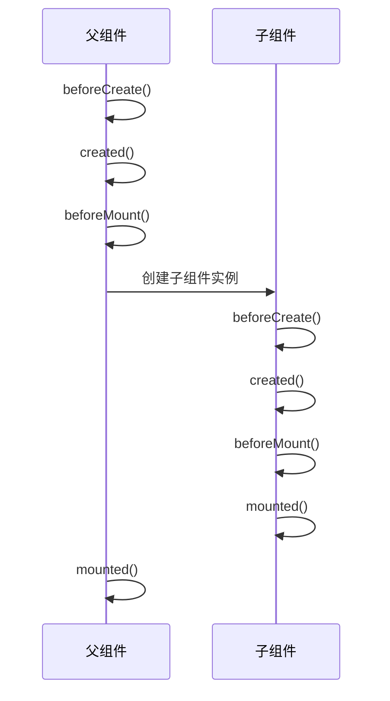
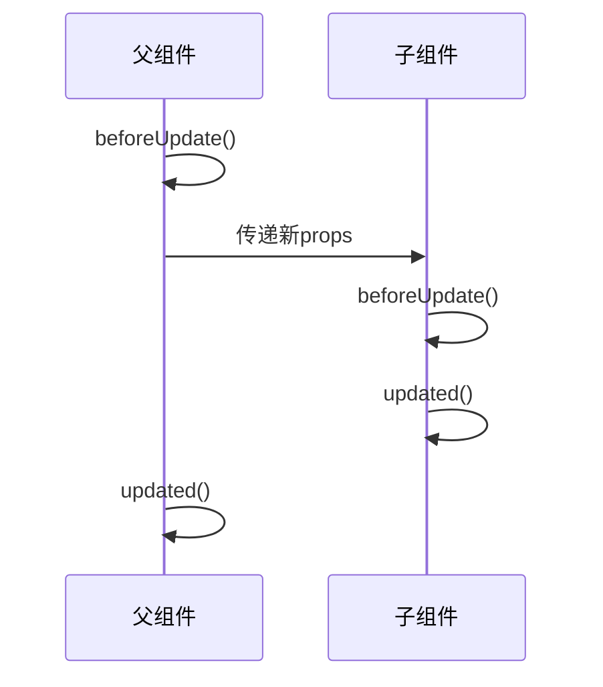
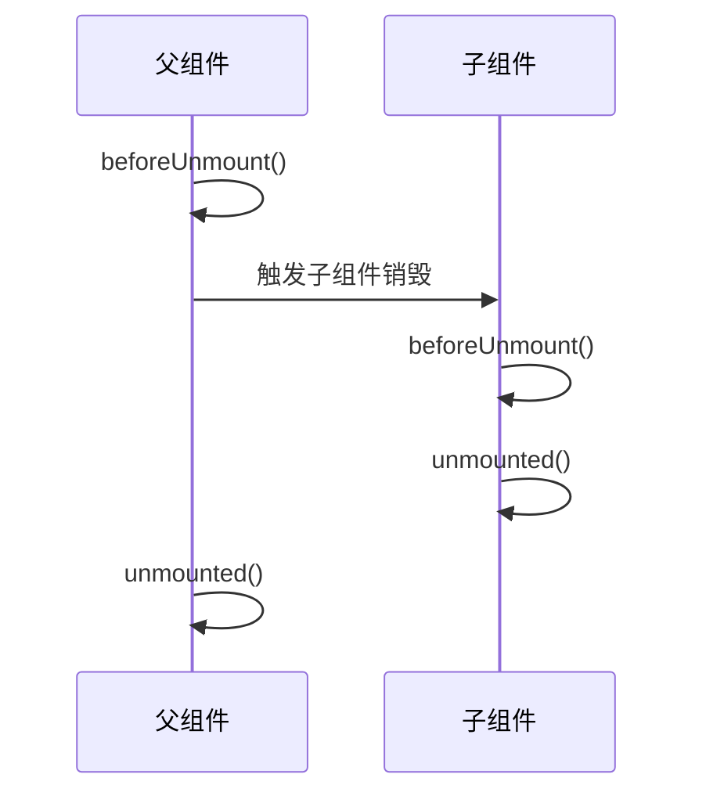
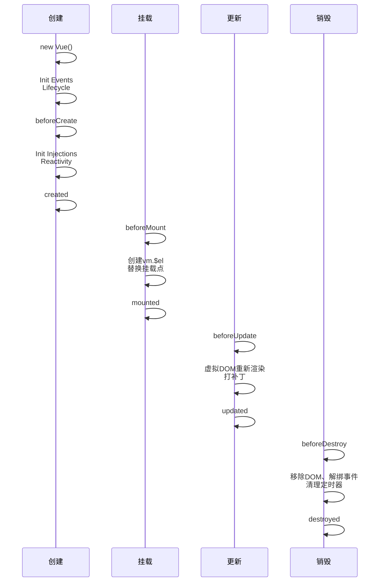

### 1. 初始渲染阶段（挂载）

在应用的初始化渲染阶段，**执行顺序** 为：

1. 父组件 `beforeCreate`
2. 父组件 `created`
3. 父组件 `beforeMount`
4. 子组件 `beforeCreate`
5. 子组件 `created`
6. 子组件 `beforeMount`
7. 子组件 `mounted`
8. 父组件 `mounted`



### 2. 更新阶段（父组件状态变化）

由父组件引发的子组件更新，一般是子组件先更新，父组件后更新。

**执行顺序**：

1. 父组件 `beforeUpdate`
2. 子组件 `beforeUpdate`
3. 子组件 `updated`
4. 父组件 `updated`



### 3. 卸载阶段（销毁）

销毁父组件时，一般是先销毁子组件，清理对应的依赖和订阅更新，然后销毁父组件。

**执行顺序**：

1. 父组件 `beforeUnmount`
2. 子组件 `beforeUnmount`
3. 子组件 `unmounted`
4. 父组件 `unmounted`



## 示例代码

以下是一个 Vue 3 生命周期钩子的示例代码：

```vue
<template>
  <div class="person">
    <h2>当前求和为：{{ sum }}</h2>
    <button @click="changeSum">点我sum+1</button>
  </div>
</template>

<script lang="ts" setup name="Person">
import {
  ref,
  onBeforeMount,
  onMounted,
  onBeforeUpdate,
  onUpdated,
  onBeforeUnmount,
  onUnmounted,
} from "vue";

// 数据
let sum = ref(0);
// 方法
function changeSum() {
  sum.value += 1;
}
console.log("setup");
// 生命周期钩子
onBeforeMount(() => {
  console.log("挂载之前");
});
onMounted(() => {
  console.log("挂载完毕");
});
onBeforeUpdate(() => {
  console.log("更新之前");
});
onUpdated(() => {
  console.log("更新完毕");
});
onBeforeUnmount(() => {
  console.log("卸载之前");
});
onUnmounted(() => {
  console.log("卸载完毕");
});
</script>
```


