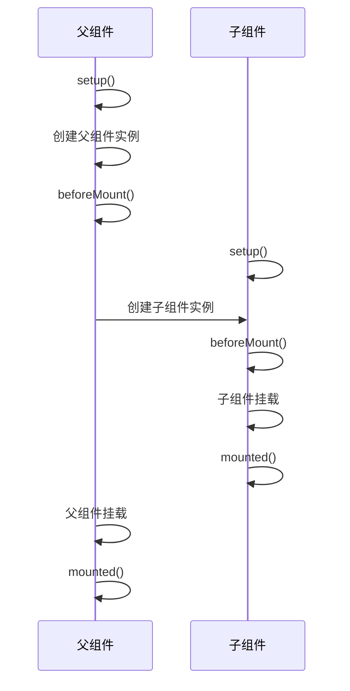
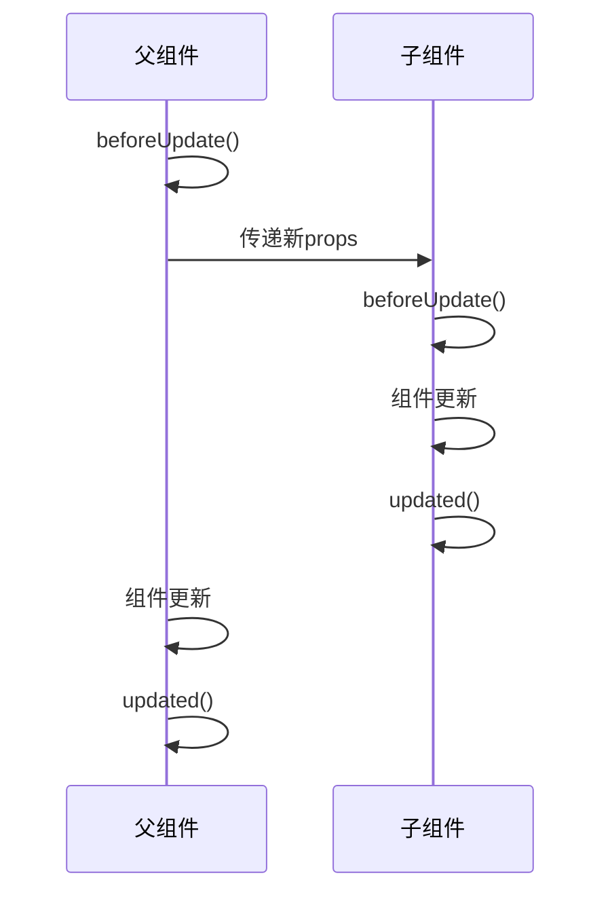
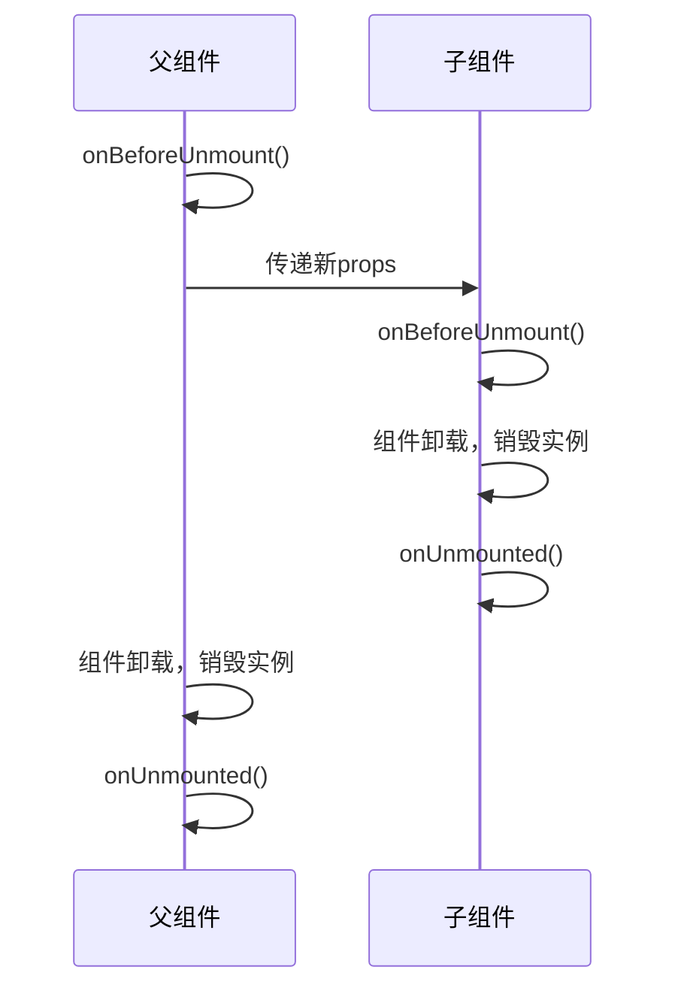

## 简介

Vue 组件实例在创建时要经历一系列的初始化步骤。在此过程中，Vue 会在合适的时机，调用特定的函数，从而让开发者有机会在特定阶段运行自己的代码，这些特定的函数统称为：==生命周期钩子==。

生命周期整体分为四个阶段，分别是：**创建、挂载、更新、销毁**，每个阶段对外暴露了两个钩子，执行前、执行后。

常用的钩子：`setup()`、`onMounted`、`onUpdated`、`onBeforeUnmount`

### 生命周期钩子列表

以下是 Vue 3 的生命周期钩子及其作用的详细列表：

| **阶段**     | **钩子**            | **执行时机**                    | **典型应用场景**                                | **注意事项**                       |
| ------------ | ------------------- | ------------------------------- | ----------------------------------------------- | ---------------------------------- |
| **创建**     | `setup()`           | 组件实例创建，响应式数据初始化  | 定义响应式变量、函数，调用接口、处理非 DOM 逻辑 | 无法访问 `this` 和 DOM             |
| **挂载**     | `onBeforeMount()`   | 模板编译完成，DOM 挂载前        | 预渲染数据处理                                  | 直接操作 DOM 无效                  |
|              | `onMounted()`       | DOM 挂载完成，子组件已渲染      | 操作 DOM、初始化第三方库（如图表）              | 可安全使用 `refs` 访问元素         |
| **更新**     | `onBeforeUpdate()`  | 响应式数据变化后，DOM 更新前    | 保存当前 DOM 状态（如滚动位置）                 | 避免修改响应式数据（可能循环更新） |
|              | `onUpdated()`       | DOM 重新渲染完成                | 基于新 DOM 布局计算（如图表重绘）               | 谨慎修改数据以防无限循环           |
| **卸载**     | `onBeforeUnmount()` | 组件卸载前，实例仍完整          | 清理定时器、取消事件监听                        | 必须清理资源防内存泄漏             |
|              | `onUnmounted()`     | 组件卸载完成，DOM 已移除        | 记录日志、确认资源释放                          | 所有子组件已销毁                   |
| **缓存组件** | `onActivated()`     | `<keep-alive>` 缓存的组件激活时 | 恢复定时器、重新拉取数据                        | 需配合 `<keep-alive>` 使用         |
|              | `onDeactivated()`   | `<keep-alive>` 缓存的组件失活时 | 暂停动画、保存临时状态                          | 非销毁，组件仍驻留内存             |
| **错误处理** | `onErrorCaptured()` | 捕获子孙组件错误时              | 全局错误上报、降级 UI 展示                      | 可返回 `false` 阻止错误冒泡        |

### 流程图


## 与 Vue 2 的生命周期对比

| 钩子名称                   | vue2           | vu3                     |
| -------------------------- | -------------- | ----------------------- |
| 创建前                     | beforeCreate   | 无（被 `setup()` 替代） |
| 创建完成                   | created        | 无（被 `setup()` 替代） |
| 挂载前                     | beforeMount    | onBeforeMount           |
| 挂载完成                   | mounted        | onMounted               |
| 更新前                     | beforeUpdate   | onBeforeUpdate          |
| 更新完成                   | updated        | onUpdated               |
| 卸载前                     | beforeDestroy  | onBeforeUnmount         |
| 卸载完成                   | destroyed      | onUnmounted             |
| 激活                       | activated      | onActivated             |
| 停用                       | deactivated    | onDeactivated           |
| 错误捕获                   | errorCaptured  | onErrorCaptured         |
| 调试跟踪钩子               | 无             | onRenderTracked         |
| 调试触发钩子               | 无             | onRenderTriggered       |
| 数据预取钩子（SSR 服务中） | serverPrefetch | onServerPrefetch        |

## 父子组件的钩子执行顺序

一般来说父子组件在逻辑上：

- 父组件先创建，子组件后创建
- 子组件先挂载，父组件后挂载
- 子组件先更新，父组件后更新
- 子组件先销毁，父组件后销毁

### 初始化渲染

页面的初始化渲染主要包含 `setup` 和挂载两个阶段。

setup 阶段主要完成了组合式 API 的初始化，这里边包含了响应式对象的创建、各种生命周期钩子的注册、侦听器的创建、计算属性的创建等。最终生成组件的实例。

挂载阶段就是将元素渲染到页面上。它包含两部分：创建 DOM 和挂载 DOM。



以上过程，我们可以用伪代码去理解：

```js
// 模拟 vue 的初始化
function init(compoment, parentElm) {
  let { setup, beforeMount, onMounted, child } = compoment;
  // 执行 setup 完成组件实例的初始化
  setup && setup();
  // 执行组件 beforeMount 钩子
  beforeMount && beforeMount();
  // 生成组件的 dom
  let elm = createElm(compoment);
  // 递归处理子组件
  if (child && child.length > 0) {
    child.forEach((item) => {
      init(item, elm);
    });
  }
  // 挂载 dom 到父组件上
  mount(elm, parentElm);
  // 完成挂载，执行 onMounted 钩子
  onMounted && onMounted();
}
// 挂载组件 dom
function mount(elm, parentElm) {
  parentElm.appendChild(elm);
}
init(compoments, document.getElementById("app"));
```

::: tip 为什么要先挂载子组件 ？
先创建 dom 并不挂载，可以一次性将 dom 挂载到页面上，避免逐个挂载给页面造成的闪烁，同时避免子节点变化对父节点造成的影响，导致频繁的重绘。
:::

### 更新阶段

更新阶段一般是子组件先更新，然后父组件再更新，其生命周期钩子的执行顺序如下：



### 卸载阶段

和更新顺序类似，卸载也是先卸载子组件，然后卸载父组件。



::: tip 为什么要先销毁子组件，而不是直接销毁父组件 ？

这是为了防止内存泄露。

1. 子组件内可能存在定时器、计时器、dom 引用等需要释放。
2. 模板渲染到过程中，对应的响应式数据和组件之间存在依赖和订阅的。直接销毁父组件，可能这些依赖和订阅无法得到真正的销毁。

:::
