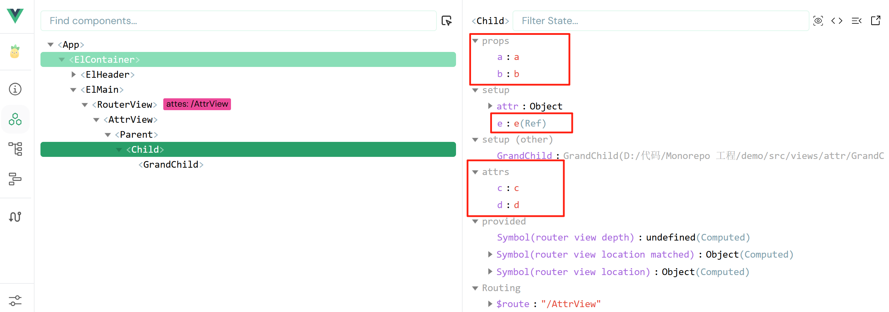

## 简介

`Vue3`组件通信和`Vue2`的区别：

- 移出事件总线，使用`mitt`代替。

* `vuex`换成了`pinia`。
* 把`.sync`优化到了`v-model`里面了。
* 把`$listeners`所有的东西，合并到`$attrs`中了。
* `$children`被砍掉了。

**常见传递形式：**


## 常见的方式

### 1、props

概述：`props`是使用频率最高的一种通信方式，常用与 ：**子 <=> 父**

- **父传子**：传递的是 **数据**。
- **子传父**：传递的是 **回调函数**。

::: code-tabs
@tab Parent.vue

```vue
<template>
  <div class="father">
    <h3>父组件，</h3>
    <h4>我的车：{{ car }}</h4>
    <h4>儿子给的玩具：{{ toy }}</h4>
    <Child :car="car" :getToy="getToy" />
  </div>
</template>

<script setup lang="ts" name="Father">
import Child from "./Child.vue";
import { ref } from "vue";
// 数据
const car = ref("奔驰");
const toy = ref();
// 方法
function getToy(value: string) {
  toy.value = value;
}
</script>
```

@tab Child.vue

```vue
<template>
  <div class="child">
    <h3>子组件</h3>
    <h4>我的玩具：{{ toy }}</h4>
    <h4>父给我的车：{{ car }}</h4>
    <button @click="getToy(toy)">玩具给父亲</button>
  </div>
</template>

<script setup lang="ts" name="Child">
import { ref } from "vue";
const toy = ref("奥特曼");

defineProps(["car", "getToy"]);
</script>
```

:::

### 2、自定义事件

1. 概述：自定义事件常用于：**子 => 父**
2. 注意区分好：原生事件、自定义事件。

#### 原生事件：

- 事件名是特定的（`click`、`mosueenter`等等）
- 事件对象`$event`: 是包含事件相关信息的对象（`pageX`、`pageY`、`target`、`keyCode`）

#### 自定义事件：

- 事件名是任意名称
- 事件对象`$event`: 是调用`emit`时所提供的数据，可以是任意类型！！！

::: code-tabs
@tab Parent.vue

```vue
<template>
  <div class="father">
    <h3>父组件，</h3>
    <h4>我的车：{{ car }}</h4>
    <h4>儿子给的玩具：{{ toy }}</h4>
    <Child @handleUpdate="handleUpdate" />
  </div>
</template>

<script setup lang="ts">
import Child from "./Child.vue";
import { ref } from "vue";
// 数据
const car = ref("奔驰");
const toy = ref("");
function handleUpdate(data) {
  console.log(payload);
}
</script>
```

@tab Child.vue

```vue
<template>
  <div class="child">
    <h3>子组件，</h3>
    <h4>我的玩具：{{ toy }}</h4>
    <button @click="sendData()">玩具给父亲</button>
  </div>
</template>

<script setup lang="ts">
import { ref } from "vue";
const emit = defineEmits(["update-data"]);
const toy = ref("奥特曼");

function sendData() {
  emit("update-data", toy);
}
</script>
```

:::

### 3、mitt

概述：与消息订阅与发布（`pubsub`）功能类似，可以实现任意组件间通信。

安装`mitt`

```shell
npm i mitt
```

#### 初始化事件中心

新建文件：`src\utils\emitter.ts`

```javascript
// 引入mitt
import mitt from "mitt";
// 创建emitter
const emitter = mitt();
// 清理事件
emitter.all.clear();
// 创建并暴露mitt
export default emitter;
```

#### 绑定事件、销毁事件

在需要响应该事件的组件中：绑定事件 `.on()`、同时在销毁前解绑事件 `.off()`：

```typescript
import emitter from "@/utils/emitter";
import { onUnmounted } from "vue";

// 绑定事件
emitter.on("send-toy", (value) => {
  console.log("send-toy事件被触发", value);
});

onUnmounted(() => {
  // 解绑事件
  emitter.off("send-toy");
});
```

#### 触发事件

提供数据的组件，在合适的时候使用 `.emit()` 触发事件

```javascript
import emitter from "@/utils/emitter";

function sendToy() {
  // 触发事件
  emitter.emit("send-toy", data);
}
```

### 4、v-model

概述：实现 **父 ↔ 子** 之间相互通信。

#### `v-model` 的本质

组件标签上的 `v-model` 的本质：`:moldeValue` ＋ `update:modelValue`事件。

```vue
<my-component v-model="userName"></my-component>
<!-- v-model 的本质是下面的代码： -->
<my-component :modelValue="userName" @update:model-value="callbackFunct">
</my-component>
```

::: code-tabs
@tab ParentComponent.vue

```vue :collapsed-lines=10
<template>
  <div class="parent">
    <h2>父组件</h2>
    <p>用户名: {{ username }}</p>
    <p>年龄: {{ age }}</p>
    <ChildComponent v-model:name="username" v-model:age="age" />
  </div>
</template>
<script setup lang="ts">
import { ref } from "vue";
import ChildComponent from "./ChildComponent.vue";

const username = ref("");
const age = ref(0);
</script>
```

@tab ChildComponent.vue

```vue :collapsed-lines=10
<template>
  <div class="child">
    <h3>子组件</h3>
    <input
      type="text"
      :value="name"
      @input="onNameChange"
      placeholder="用户名"
    />
    <input
      type="number"
      :value="age"
      @input="onAgeChange"
      placeholder="输入年龄"
    />
  </div>
</template>
<script setup lang="ts">
defineProps<{
  name: string;
  age: number;
}>();

const emit = defineEmits<{
  (e: "update:name", value: string): void;
  (e: "update:age", value: number): void;
}>();

const handleNameChange = (e: Event) => {
  emit("update:name", (e.target as HTMLInputElement).value);
};

const handleAgeChange = (e: Event) => {
  emit("update:age", Number((e.target as HTMLInputElement).value));
};
</script>
```

:::

### 5、`$attrs`

在 Vue 中，`$attrs` 是一个内置的组件属性，它包含了父组件传递给子组件的所有非 prop 属性（包括 Class、Style、原生 HTML 属性、自定义事件监听器等）。这些属性没有被子组件的 props 显式声明接收。

我们可以直接在子组件的模板上使用 `$attrs` 来获取或传递这些属性。

```vue
<div>{{ $attrs }}</div>
<child-component v-bind="$attrs"></child-component>
```

也可以在子组件的代码中使用 `useAttrs` 来获取：

```vue
<script lang="ts" setup>
import { useAttrs } from "vue";
const attr = useAttrs();
console.log(attr);
</script>
```

::: info 我们把 **`$attrs`** 比作遗产:

- 父亲给儿子在银行留了 **_A、B、C、D_** 四份遗产；
- 儿子把 **_A、B_** 取出来拿去创业了，**_C、D_** 没动，最后剩下 **_E_** 存进了银行；
- 此时，留给孙子的遗产就是 **_C、D、E_**，其中 **_C、D_** 来自父亲，**_E_** 来自儿子；

:::

#### 代码示例

::: code-tabs
@tab AttrParent.vue
@[code vue :collapsed-lines=10](../demo/AttrParent.vue)
@tab AttrChild.vue
@[code vue :collapsed-lines=10](../demo/AttrChild.vue)
@tab AttrGrandChild.vue
@[code vue :collapsed-lines=10](../demo/AttrGrandChild.vue)

:::

#### 效果

@[demo vue](../demo/AttrParent.vue)

我们可以使用浏览器的 vue 提供的 devtool 查看：



### 6、`$refs`、`$parent` <badge type="warning">不推荐</badge>

| 属性      | 方向        | 说明                                                         |
| --------- | ----------- | ------------------------------------------------------------ |
| `$refs`   | **父 → 子** | 值为对象，包含所有被 `ref` 属性标识的 `DOM` 元素或组件实例。 |
| `$parent` | **子 → 父** | 值为对象，当前组件的父组件实例对象。                         |

::: info 建议
在组合式 API，也就是 setup 语法糖中，比较建议使用 `defineExpose()` ，来 **选择性对外暴露数据**，便于控制 `$refs`、`$parent` 获取数据的范围。
:::
::: warning 注意
在组件开发时，我们倾向保持数据的单向流动，所以我们推荐使用 `v-model`/`自定义事件`/`provide`/`inject` 来完成组件之间的数据传递。不推荐使用 `$refs`、`$parent`
:::

#### 效果

@[demo vue](../demo/RefParent.vue)

#### 示例代码

上述效果的代码如下：

::: code-tabs

@tab RefParent.vue
@[code vue :collapsed-lines=10](../demo/RefParent.vue)
@tab RefChild.vue
@[code vue :collapsed-lines=10](../demo/RefChild.vue)

:::

### 7、provide、inject

实现 **祖 => 孙** 直接通信

- 在祖先组件中通过 `provide` 配置向后代组件提供数据
- 在需要接收数据的后代组件中通过 `inject` 配置来声明接收数据
- 其他层级的组件不需要任何处理

#### 案例

@[demo vue](../demo/InjectParent.vue)

#### 示例代码

以上效果的代码：

::: code-tabs
@tab Parent.vue
@[code vue :collapsed-lines=10](../demo/InjectParent.vue)

@tab Child.vue
@[code vue :collapsed-lines=10](../demo/InjectChild.vue)

@tab GrandChild.vue
@[code vue :collapsed-lines=10](../demo/InjectGrandChild.vue)

:::
