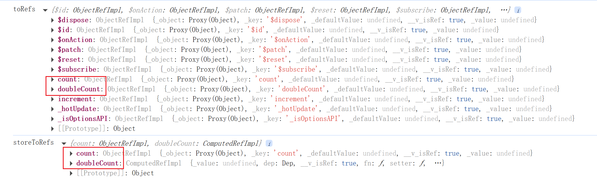

## 简介

在 Vue.js 生态中，**Store（存储）** 是 Pinia 状态管理的核心单元，相当于一个独立的状态容器，用于集中管理特定领域的应用数据。

### Store 的本质

Store 的本质就是一个响应式数据容器

- 包含：状态（`state`）、计算属性（`getters`）和操作方法（`actions`）
- 基于 Vue 的响应式系统，状态变更自动触发视图更新
- 根据业务定义多个 store（如：`userStore`, `cartStore`, `settingsStore`）
- 每个 store 的第一个参数是它的唯一 ID（如 `defineStore('user', ...)`）

### Store 的定义

#### 选项式写法

```javascript
import { defineStore } from "pinia";

export const useStore = defineStore("storeId", {
  // 状态 (必须为函数返回对象)
  state: () => ({
    count: 0,
  }),

  // 计算属性 (类似 Vue 的 computed)
  getters: {
    doubleCount: (state) => state.count * 2,
    // 带参数的计算属性
    countPlus: (state) => (num) => state.count + num,
  },

  // 操作方法 (同步/异步逻辑)
  actions: {
    increment() {
      this.count++; // 直接通过 this 访问状态
    },
  },
});
```

#### 组合式 API 写法

```ts
// 组合式API
import { ref } from "vue";
import { defineStore } from "pinia";

export const useUserInfoStore = defineStore("userInfo", () => {
  const name = ref("kangkang");
  const age = ref(18);
  function changename() {
    name.value += "6";
  }

  return { name, age, changename };
});
```

### Store 生命周期

1. **创建**：首次调用时创建实例
2. **激活**：组件中使用时自动激活响应式
3. **销毁**：组件卸载时自动垃圾回收（除非全局引用）

## 核心操作

### 状态访问

一般可以直接通过返回的实例来访问对应的状态值，也可以通过解构来访问。

```js
import { useCounterStore } from "@store/counter";
import { storeToRefs } from "pinia";
import { toRefs } from "vue";
const store = useCounterStore();
// 直接访问
console.log(store.count);
// 解构需保持响应式 toRefs
const { count } = toRefs(store);
// 解构需保持响应式 storeToRefs
const { count } = storeToRefs(store);
```

一般来说推荐使用 `storeToRefs` 解构，来简化代码里的使用。通过打印相关结果，我们可以看到更推荐使用 `storeToRefs()` 只会保留内部的状态值，而 `toRefs()` 会将所有的内部属性、方法转换。



### 状态变更

一般来说有三种方式:

#### 1、直接修改

```ts
countStore.sum = 666;
```

#### 2、批量修改 `$patch()`

```ts
countStore.$patch({
  sum: 999,
  school: "atguigu",
});
```

#### 3、借用 action

借助`action`修改（`action`中可以编写一些业务逻辑）

```ts
import { defineStore } from "pinia";

export const useCountStore = defineStore("count", {
  actions: {
    incrementOdd(value: number) {
      if (this.sum < 10) {
        //操作countStore中的sum
        this.sum += value;
      }
    },
  },
});
```

我们可以直接在代码中直接调用该 action 来使用：

```ts
// 使用countStore
const countStore = useCountStore();

// 调用对应action
countStore.incrementOdd(n.value);
```

组合式 API 的方法，是一种特殊的 action

```ts
// 组合式API
import { ref } from "vue";
import { defineStore } from "pinia";

export const useUserInfoStore = defineStore("userInfo", () => {
  const name = ref("kangkang");
  function changename() {
    name.value += "6";
  }

  return { name, changename };
});
```

我们一样可以通过 store 实例来调用这个方法：

```ts
const userInfoStore = useUserInfoStore();
userInfoStore.changename();
```

### 状态重置

使用选项式 API 时，你可以通过调用 store 实例的 `$reset()` 方法将 state 重置为初始值。

```js
const store = useStore();
store.$reset();
```

使用组合式 API 写法时，需要在单独 store 里实现相关逻辑。

```js
export const useCounterStore = defineStore("counter", () => {
  const count = ref(0);
  function $reset() {
    count.value = 0;
  }
  return { count, $reset };
});
```

### 状态订阅

类似于 Vuex 的 `subscribe` 方法，你可以通过 store 的 `$subscribe()` 方法侦听 state 及其变化。比起普通的 `watch()`，使用 `$subscribe()` 的好处是 subscriptions 在 _patch_ 后只触发一次 (例如，当使用上面的函数版本时)。该订阅会随着组件销毁而被回收。

```js
store.$subscribe((mutation, state) => {
  console.log("状态变化:", mutation, state);
  // import { MutationType } from 'pinia'
  mutation.type; // 'direct' | 'patch object' | 'patch function'
  // 和 cartStore.$id 一样
  mutation.storeId; // 'cart'
  // 只有 mutation.type === 'patch object'的情况下才可用
  mutation.payload; // 传递给 cartStore.$patch() 的补丁对象。

  // 每当状态发生变化时，将整个 state 持久化到本地存储。
  localStorage.setItem("cart", JSON.stringify(state));
});
```

::: note 持久化存储

安装插件

```ts
import { createPinia } from "pinia";
import piniaPluginPersistedstate from "pinia-plugin-persistedstate";

const pinia = createPinia();
pinia.use(piniaPluginPersistedstate);
```

在 store 中配置 `persist` 属性

```ts
defineStore("counter", {
  // ...其他配置
  persist: true,
});
```

:::

## 案例

::: code-tabs

@tab src/store/count.ts

```ts
// 引入defineStore用于创建store
import { defineStore } from "pinia";

// 定义并暴露一个store
export const useCountStore = defineStore("count", {
  // 动作
  actions: {},
  // 状态
  state() {
    return {
      sum: 6,
    };
  },
  // 计算
  getters: {},
});
```

@tab src/store/talk.ts

```js
// 引入defineStore用于创建store
import { defineStore } from "pinia";

// 定义并暴露一个store
export const useTalkStore = defineStore("talk", {
  // 动作
  actions: {},
  // 状态
  state() {
    return {
      talkList: [
        { id: "yuysada01", content: "你今天有点怪，哪里怪？怪好看的！" },
        { id: "yuysada02", content: "草莓、蓝莓、蔓越莓，你想我了没？" },
        { id: "yuysada03", content: "心里给你留了一块地，我的死心塌地" },
      ],
    };
  },
  // 计算
  getters: {},
});
```

@tab HomeView.vue

```vue
<template>
  <h2>当前求和为：{{ sumStore.sum }}</h2>
</template>

<script setup lang="ts" name="Count">
// 引入对应的useXxxxxStore
import { useSumStore } from "@/store/sum";

// 调用useXxxxxStore得到对应的store
const sumStore = useSumStore();
</script>
```

@tab TalkView.vue

```vue
<template>
  <ul>
    <li v-for="talk in talkStore.talkList" :key="talk.id">
      {{ talk.content }}
    </li>
  </ul>
</template>

<script setup lang="ts" name="Count">
import axios from "axios";
import { useTalkStore } from "@/store/talk";

const talkStore = useTalkStore();
</script>
```

:::
