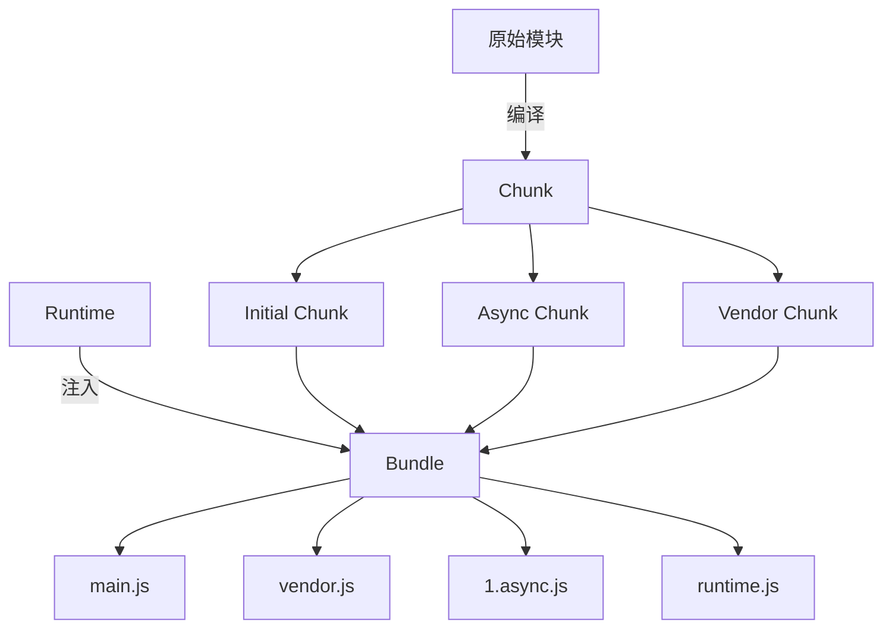

以下是 Webpack 中 **Chunk**、**Vendor**、**Bundle** 和 **Runtime** 的详细概念解析，通过对比和示例帮助你彻底理解它们的区别与联系：

## Chunk 代码块

### 1、定义

Webpack 内部的代码分割单元，是模块（Module）的集合，代表编译过程中的中间产物。

### 2、核心特点

#### 类型

- 每个入口文件（entry）生成一个 **Initial Chunk**
- 动态导入（`import()`）生成 **Async Chunk**
- 通过 `splitChunks` 拆分出的公共代码块
- 第三方库代码（`node_modules`）生成的 **Vendor Chunk**

#### 示例配置

```javascript
// 动态导入生成 Async Chunk
const lazyModule = () => import(/* webpackChunkName: "lazy" */ "./lazy.js");
```

#### 作用

控制代码如何被拆分，优化加载性能。

## Vendor 第三方依赖库

### 1、定义

专门存放从 `node_modules` 引入的第三方库的 **特殊 Chunk**。

### 2、核心特点

#### 优化意义

- 单独打包，便于利用浏览器缓存（第三方代码更新频率低）
- 避免重复打包相同的依赖

#### 典型配置

```javascript
optimization: {
  splitChunks: {
    cacheGroups: {
      vendor: {
        test: /[\\/]node_modules[\\/]/,  // 匹配 node_modules
        name: 'vendor',
        chunks: 'all',
      }
    }
  }
}
```

#### 输出文件

`vendor.[hash].js`（包含 React、Lodash 等库）

## Bundle 输出文件

### 1、定义

最终生成的、可直接被浏览器加载的文件，由一个或多个 Chunk 经过合并和优化后生成。

### 2、核心特点

#### 与 Chunk 的关系

- 1 个 Bundle 可能包含多个 Chunk
- 1 个 Chunk 也可能输出为多个 Bundle（如代码分割后）
- 主 Bundle （代码入口）包含 Initial Chunk + Runtime

#### 输出配置

```javascript
output: {
  filename: '[name].[contenthash].js',  // 入口 Bundle
  chunkFilename: '[name].[chunkhash].js' // 非入口 Bundle
}
```

#### 常见文件

- `main.js`（入口 Bundle）
- `vendor.js`（第三方库 Bundle）
- `1.async.js`（动态加载的 Bundle，代码中被 `import()` 引入的模块）

## Runtime 运行时

### 1、定义

Webpack 生成的胶水代码，用于管理模块的加载、解析和执行。

### 2、核心特点

#### 包含内容

- `__webpack_require__` 函数：用来替换 ES Module、CommonJS 等模块化语法，抹平浏览器之间的差异
- 模块缓存逻辑
- 异步 Chunk 的加载逻辑

#### 优化配置

```javascript
// 单独提取 Runtime，避免影响主文件缓存
optimization: {
  runtimeChunk: "single";
}
```

#### 输出文件

`runtime~main.js`（文件较小，通常几 KB）

## 四者关系总结



## 关键区别对比表

| 概念        | 阶段       | 生成方式               | 典型文件名         | 作用对象         |
| ----------- | ---------- | ---------------------- | ------------------ | ---------------- |
| **Chunk**   | 编译过程中 | Webpack 编译的中间产物 | -                  | 模块集合         |
| **Vendor**  | 优化阶段   | 从 `node_modules` 提取 | `vendor.[hash].js` | 第三方库         |
| **Bundle**  | 输出阶段   | Chunk 的最终打包结果   | `main.[hash].js`   | 可直接运行的文件 |
| **Runtime** | 运行时生成 | Webpack 注入的胶水代码 | `runtime~main.js`  | 模块加载逻辑     |
