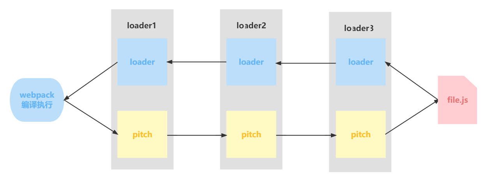

## loader 概念

帮助 webpack 将不同类型的文件转换为 webpack 可识别的模块。

## loader 的使用

- 配置方式：在 `webpack.config.js` 文件中指定 loader。（`pre`、`normal`、`post`）
- 内联方式：在每个 `import` 语句中显式指定 loader。（`inline`）

### 1、优先级

Loader 的优先级是根据 `enforce` 属性来确定的，是配置 rule 时手动改变执行顺序的一种规则标记。

- pre： 前置 loader
- normal： 普通 loader
- inline： 内联 loader
- post： 后置 loader

### 2、loader 执行顺序

#### 优先级不同时的执行顺序

4 类 loader 的执行优级为：`pre` > `normal` > `inline` > `post`。

```js
// 此时loader执行顺序：loader1 - loader2 - loader3
module: {
  rules: [
    { enforce: "pre", test: /\.js$/, loader: "loader1" },
    { test: /\.js$/, loader: "loader2" }, // 没有enforce就是normal
    { enforce: "post", test: /\.js$/, loader: "loader3" },
  ],
},
```

#### 优先级相同时的执行顺序

相同优先级的 loader 执行顺序为：==从右到左，从下到上==。

```js
// 此时loader执行顺序：loader3 - loader2 - loader1
module: {
  rules: [
    { test: /\.js$/, loader: "loader1" },
    { test: /\.js$/, loader: "loader2" },
    { test: /\.js$/, loader: "loader3" },
  ],
},
```

::: note 建议将多个 loader 配置到一个 rule 里，这样就可以 `oneof()` 来提升特定资源的匹配效率
:::

```js
// 此时loader执行顺序：loader3 - loader2 - loader1
module: {
  rules: [
    {
      test: /\.js$/,
      use: [ "loader1", "loader2", "loader3"]
    },
  ],
},
```

### 3、内联 inline loader

#### 用法

`import Styles from 'style-loader!css-loader?modules!./styles.css';`

- 引入 `styles.css` 文件的同时，使用 `css-loader` 和 `style-loader` 处理
- 通过 `!` 将资源中的 loader 分开

#### 控制符

`inline loader` 可以通过添加不同前缀，跳过其他类型 loader。

- `!`：跳过 `normal` 的 loader。

  `import Styles from '!style-loader!css-loader?modules!./styles.css';`

- `-!`：跳过 `pre`、`normal` 的 loader。

  `import Styles from '-!style-loader!css-loader?modules!./styles.css';`

- `!!`：跳过 `pre`、`normal`、`post` 的 loader。

  `import Styles from '!!style-loader!css-loader?modules!./styles.css';`

## 开发一个 loader

### 1. 最简单的 loader

```js
// loaders/loader1.js
module.exports = function loader1(content) {
  console.log("hello loader");
  return content;
};
```

它接受要处理的源码作为参数，输出转换后的 js 代码。

### 2、loader 接受的参数

```js
module.exports = function (content, map, meta) {
  return content;
};
```

- `content` 源文件的内容
- `map` SourceMap 数据
- `meta` 数据，可以是任何内容

### 3、loader 分类

#### 同步 loader

```js
module.exports = function (content, map, meta) {
  // 传递map，让source-map不中断
  // 传递meta，让下一个loader接收到其他参数
  this.callback(null, content, map, meta);
  return; // 当调用 callback() 函数时，总是返回 undefined
};
```

`this.callback` 方法则更灵活，因为它允许传递多个参数，而不仅仅是 `content`。

#### 异步 loader

```js
module.exports = function (content, map, meta) {
  const callback = this.async();
  // 进行异步操作
  setTimeout(() => {
    callback(null, result, map, meta);
  }, 1000);
};
```

> 由于同步计算过于耗时，在 Node.js 这样的单线程环境下进行此操作并不是好的方案，我们建议尽可能地使你的 loader 异步化。但如果计算量很小，同步 loader 也是可以的。

#### Raw Loader

默认情况下，资源文件会被转化为 UTF-8 字符串，然后传给 loader。通过设置 raw 为 true，loader 可以接收原始的 Buffer。

```js
module.exports = function (content) {
  // content是一个Buffer数据
  return content;
};
module.exports.raw = true; // 开启 Raw Loader
```

#### Pitching Loader

```js
module.exports = function (content) {
  return content;
};
module.exports.pitch = function (remainingRequest, precedingRequest, data) {
  console.log("do somethings");
};
```

webpack 会先从左到右执行 loader 链中的每个 loader 上的 pitch 方法（如果有），然后再从右到左执行 loader 链中的每个 loader 上的普通 loader 方法。



在这个过程中如果任何 pitch 有返回值，则 loader 链被阻断。webpack 会跳过后面所有的的 pitch 和 loader，直接进入上一个 loader 。


### 4、参考 API

| 方法名                  | 含义                                       | 用法                                           |
| ----------------------- | ------------------------------------------ | ---------------------------------------------- |
| this.async              | 异步回调 loader。返回 this.callback        | const callback = this.async()                  |
| this.callback           | 可以同步或者异步调用的并返回多个结果的函数 | this.callback(err, content, sourceMap?, meta?) |
| this.getOptions(schema) | 获取 loader 的 options                     | this.getOptions(schema)                        |
| this.emitFile           | 产生一个文件                               | this.emitFile(name, content, sourceMap)        |
| this.utils.contextify   | 返回一个相对路径                           | this.utils.contextify(context, request)        |
| this.utils.absolutify   | 返回一个绝对路径                           | this.utils.absolutify(context, request)        |

> 更多文档，请查阅 [webpack 官方 loader api 文档](https://webpack.docschina.org/api/loaders/#the-loader-context)

## 案例

### 1、手写 clean-log-loader

作用：用来清理 js 代码中的`console.log`

```js
// loaders/clean-log-loader.js
module.exports = function cleanLogLoader(content) {
  // 将console.log替换为空
  return content.replace(/console\.log\(.*\);?/g, "");
};
```

### 2、手写 banner-loader

作用：给 js 代码添加文本注释

:::: code-tabs

@tab loaders/banner-loader/index.js

```js
const schema = require("./schema.json");

module.exports = function (content) {
  // 获取loader的options，同时对options内容进行校验
  // schema是options的校验规则（符合 JSON schema 规则）
  const options = this.getOptions(schema);

  const prefix = `
    /*
    * Author: ${options.author}
    */
  `;

  return `${prefix} \n ${content}`;
};
```

@tab loaders/banner-loader/schema.json

```json
{
  "type": "object",
  "properties": {
    "author": {
      "type": "string"
    }
  },
  "additionalProperties": false
}
```

::::

### 3、手写 babel-loader

作用：编译 js 代码，将 ES6+语法编译成 ES5-语法。

下载依赖：

```bash
npm i @babel/core @babel/preset-env -D
```

:::: code-tabs

@tab loaders/babel-loader/index.js

```js
const schema = require("./schema.json");
const babel = require("@babel/core");

module.exports = function (content) {
  const options = this.getOptions(schema);
  // 使用异步loader
  const callback = this.async();
  // 使用babel对js代码进行编译
  babel.transform(content, options, function (err, result) {
    callback(err, result.code);
  });
};
```

@tab loaders/banner-loader/schema.json

```json
{
  "type": "object",
  "properties": {
    "presets": {
      "type": "array"
    }
  },
  "additionalProperties": true
}
```

::::

### 4、手写 file-loader

作用：将文件原封不动输出出去

下载依赖：

```bash
npm i loader-utils -D
```

封装 loader：

```js title="loaders/file-loader.js"
const loaderUtils = require("loader-utils");

function fileLoader(content) {
  // 根据文件内容生产一个新的文件名称
  const filename = loaderUtils.interpolateName(this, "[hash].[ext]", {
    content,
  });
  // 输出文件
  this.emitFile(filename, content);
  // 暴露出去，给js引用。
  // 记得加上''
  return `export default '${filename}'`;
}

// loader 解决的是二进制的内容
// 图片是 Buffer 数据
fileLoader.raw = true;

module.exports = fileLoader;
```

引入 loader：

```js
{
  test: /\.(png|jpe?g|gif)$/,
  loader: "./loaders/file-loader.js",
  type: "javascript/auto", // 解决图片重复打包问题
},
```

### 5、手写 style-loader

作用：动态创建 style 标签，插入 js 中的样式代码，使样式生效。

```js title="loaders/style-loader.js"
const styleLoader = () => {};

styleLoader.pitch = function (remainingRequest) {
  /*
    remainingRequest: C:\Users\86176\Desktop\source\node_modules\css-loader\dist\cjs.js!C:\Users\86176\Desktop\source\src\css\index.css
      这里是inline loader用法，代表后面还有一个css-loader等待处理

    最终我们需要将remainingRequest中的路径转化成相对路径，webpack才能处理
      希望得到：../../node_modules/css-loader/dist/cjs.js!./index.css

    所以：需要将绝对路径转化成相对路径
    要求：
      1. 必须是相对路径
      2. 相对路径必须以 ./ 或 ../ 开头
      3. 相对路径的路径分隔符必须是 / ，不能是 \
  */
  const relativeRequest = remainingRequest
    .split("!")
    .map((part) => {
      // 将路径转化为相对路径
      const relativePath = this.utils.contextify(this.context, part);
      return relativePath;
    })
    .join("!");

  /*
    !!${relativeRequest} 
      relativeRequest：../../node_modules/css-loader/dist/cjs.js!./index.css
      relativeRequest是inline loader用法，代表要处理的index.css资源, 使用css-loader处理
      !!代表禁用所有配置的loader，只使用inline loader。（也就是外面我们style-loader和css-loader）,它们被禁用了，只是用我们指定的inline loader，也就是css-loader

    import style from "!!${relativeRequest}"
      引入css-loader处理后的css文件
      为什么需要css-loader处理css文件，不是我们直接读取css文件使用呢？
      因为可能存在@import导入css语法，这些语法就要通过css-loader解析才能变成一个css文件，否则我们引入的css资源会缺少
    const styleEl = document.createElement('style')
      动态创建style标签
    styleEl.innerHTML = style
      将style标签内容设置为处理后的css代码
    document.head.appendChild(styleEl)
      添加到head中生效
  */
  const script = `
    import style from "!!${relativeRequest}"
    const styleEl = document.createElement('style')
    styleEl.innerHTML = style
    document.head.appendChild(styleEl)
  `;

  // style-loader是第一个loader, 由于return导致熔断，所以其他loader不执行了（不管是normal还是pitch）
  return script;
};

module.exports = styleLoader;
```
