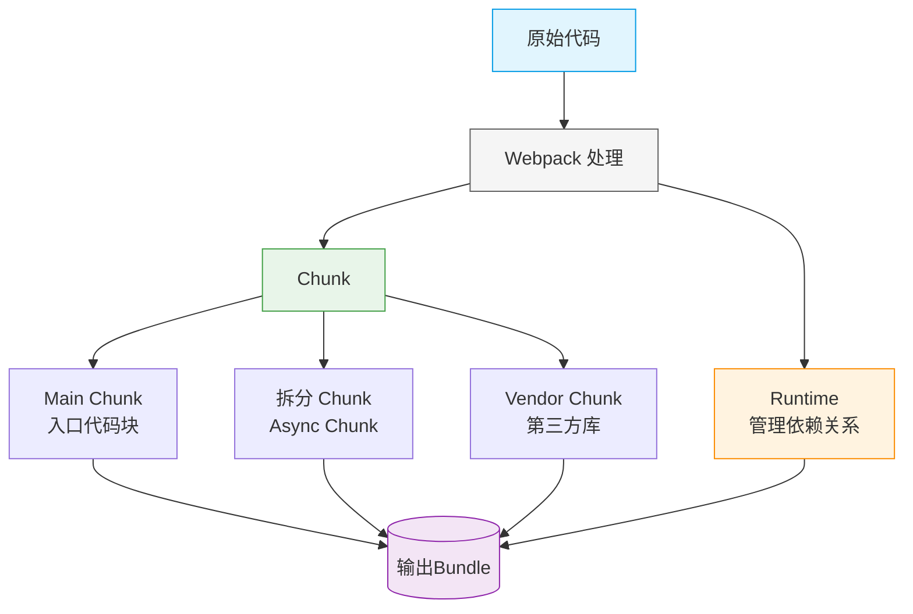

理解这些核心概念对于优化 Webpack 构建和前端性能至关重要。以下是它们的详细解释和相互关系：

## 一、简介

| 术语        | 定义                                           | 示例                                          |
| ----------- | ---------------------------------------------- | --------------------------------------------- |
| **Chunk**   | Webpack 内部的处理单元，代表一组模块的集合     | 一个动态导入(`import()`)会生成独立的 chunk    |
| **Vendor**  | 第三方依赖库的集合（通常来自 node_modules）    | React、Lodash 等第三方库打包成的 vendor-chunk |
| **Bundle**  | 最终输出的文件，可能包含一个或多个 chunk       | `main.bundle.js`、`vendor.bundle.js`          |
| **Runtime** | Webpack 生成的用于管理模块加载和执行的核心代码 | 包含 `__webpack_require__` 等辅助函数的代码段 |

## 二、关系图解



## 三、详细解析

### 1. Chunk (代码块)

**特点**：

- Webpack 内部的中间构建产物
- 分为 **初始 chunk** (initial) 和 **异步 chunk** (async)
- 通过 `splitChunks` 配置控制生成

**生成方式**：

```javascript
// 1. 入口文件生成 initial chunk
entry: {
  app: "./src/index.js";
}

// 2. 动态导入生成 async chunk
import(/* webpackChunkName: "lazy" */ "./lazy.js");
```

### 2. Vendor (第三方库)

**优化意义**：

- 单独打包便于长期缓存（内容变更少）
- 避免重复打包相同依赖

**典型配置**：

```javascript
optimization: {
  splitChunks: {
    cacheGroups: {
      vendor: {
        test: /[\\/]node_modules[\\/]/,
        name: 'vendors',
        chunks: 'all'
      }
    }
  }
}
```

### 3. Bundle (输出文件)

**组成要素**：

- 一个或多个 chunk
- 可能包含 runtime
- 经过压缩/优化的最终产物

**输出配置**：

```javascript
output: {
  filename: '[name].[contenthash].bundle.js', // 入口 bundle
  chunkFilename: '[name].[contenthash].chunk.js' // 非入口 bundle
}
```

### 4. Runtime (运行时)

**核心功能**：

- 模块加载器 (`__webpack_require__`)
- 模块缓存管理
- 异步 chunk 加载逻辑

**优化配置**：

```javascript
optimization: {
  runtimeChunk: {
    name: (entrypoint) => `runtime-${entrypoint.name}`;
  }
}
```

## 四、实际构建示例

### 项目结构

```
src/
  index.js (入口)
  utils.js
  lazy.js (动态导入)
node_modules/
  react/
  lodash/
```

### 输出结果

```
dist/
  main.bundle.js (包含app chunk + runtime)
  vendors.bundle.js (vendor chunk)
  lazy.chunk.js (异步chunk)
```

## 五、性能优化建议

1. **Vendor 分离**：

   ```javascript
   // 将第三方库单独打包
   cacheGroups: {
     vendor: {
       test: /[\\/]node_modules[\\/]/,
       name: 'vendor',
       priority: 10
     }
   }
   ```

2. **Runtime 提取**：

   ```javascript
   // 避免入口文件变更导致vendor缓存失效
   optimization.runtimeChunk = "single";
   ```

3. **Chunk 分割策略**：

   ```javascript
   splitChunks: {
     chunks: 'all',
     maxSize: 244 * 1024 // 拆分大于244KB的chunk
   }
   ```

4. **长期缓存配置**：
   ```javascript
   output: {
     filename: '[name].[contenthash:8].js',
     chunkFilename: '[name].[contenthash:8].chunk.js'
   }
   ```

## 六、概念对比表

| 维度         | Chunk        | Vendor     | Bundle       | Runtime          |
| ------------ | ------------ | ---------- | ------------ | ---------------- |
| **存在阶段** | 构建过程中   | 构建过程中 | 构建完成后   | 构建完成后       |
| **组成**     | 原始模块集合 | 第三方模块 | 最终输出文件 | Webpack 胶水代码 |
| **数量**     | 多个         | 通常 1 个  | 多个         | 通常 1 个        |
| **可配置性** | 高           | 高         | 中           | 低               |
| **缓存策略** | 内容 hash    | 内容 hash  | 文件名 hash  | 单独 hash        |

理解这些概念的区别和联系，可以帮助开发者：

1. 更精准地控制代码分割策略
2. 优化长期缓存机制
3. 减少不必要的重复构建
4. 提升应用加载性能
