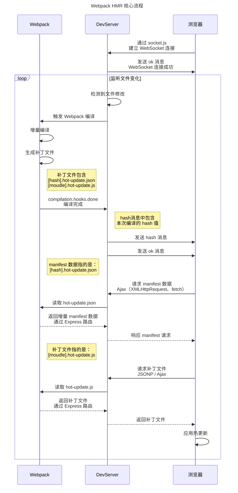
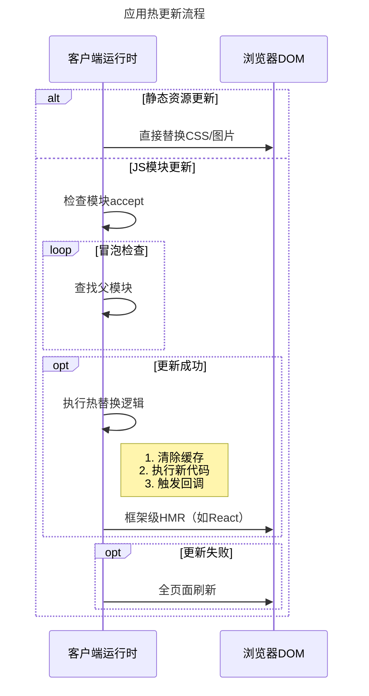

Webpack 的 HMR（Hot Module Replacement，热模块替换）基本流程可以分为以下几个关键阶段：

::: note 总结

- 使用 DevServer 托管静态资源，同时以 Runtime 方式注入 HMR 客户端代码
- 浏览器加载页面后，与 WDS 建立 WebSocket 连接
- Webpack 监听到文件变化后，增量构建发生变更的模块，并通过 WebSocket 发送 hash 事件
- 浏览器接收到 hash 事件后，请求 manifest 资源文件，确认增量变更范围
- 浏览器加载发生变更的增量模块
- Webpack 运行时触发变更模块的 module.hot.accept 回调，执行代码变更逻辑
- done

:::

## 核心流程图

首先我们来看流程图，然后再去详细分析





## 主要环节

以下仅作为对流程图上关键节点的补充说明：

### 1. 启用 HMR

在 Webpack 配置中启用 `HotModuleReplacementPlugin`，并配置 `devServer.hot: true`。

```javascript
// webpack.config.js
plugins: [new webpack.HotModuleReplacementPlugin()],
devServer: { hot: true }
```

### 2. 在客户端注入 `runtime` 代码

Webpack 在打包时自动注入 `runtime` 代码，浏览器在打开资源时，自动运行 `runtime` 代码，并和 devServer 之间建立 WebSocket 连接。

`runtime` 代码主要包含两部分：

- `webpack-dev-server/client`：负责管理和 devServer 之间的 WebSocket 链接，请求 manifest 数据、补丁文件。
- `webpack/hot/dev-server`：用于处理 HMR 运行时的模块补丁替换和状态管理。

### 3. 文件变更监听、触发重新编译

开发服务器 devServer 使用 `chokidar` 监听文件系统的变化。

当文件被修改时，Webpack 启动增量编译，仅重新构建受影响的模块。

### 4. 生成编译补丁

Webpack 在完成增量编译后，会生成 Hash、Manifest、补丁文件。

- `hash`：本次编译的唯一标识，作为版本标识用于后续模块更新
- `[hash].hot-update.json`：更新清单，记录哪些模块需要更新
- `[hash].[module-id].hot-update.js`：包含更新后的模块代码

::: note 注意

在 webpack 5 以前

:::

#### Manifest 信息

Manifest 信息指的就是 `[hash].hot-update.json` 文件的内容，包含了本次编译的 `hash`、需要更新的 `chunk` 以及需要更新的模块。

```json title="[hash].hot-update.json"
{
  "h": "a1b2c3d4", // 本次编译的 hash
  "c": { "main": true }, // 需要更新的 chunk
  "u": ["./src/Button.js"] // 需要更新的模块
}
```

#### 补丁文件

补丁文件指的就是 `[hash].[module-id].hot-update.js` 文件的内容，包含了更新后的模块代码。

其中最重要的部分就是：

```js
webpackHotUpdate("main", {
  "./src/Button.js": (/* 新模块函数 */)
});
```

![`[hash].[module-id].hot-update.js`](../assets/HotUpdateFile.png)

### 5. WebSocket 推送更新通知

devServer 通过 WebSocket 向浏览器推送两类消息：

- `hash` 消息：携带最新编译的 `hash` 值。

  ```json
  [{ "type": "hash", "data": "15b70e9df55bc075daeb" }]
  ```

- `ok` 消息：表示编译完成，可以开始更新。

  ```json
  [{ "type": "ok" }]
  ```

### 6. 浏览器检查更新

浏览器（即`runtime`）收到 `ok` 消息后，根据 `hash` 消息中携带的 `hash` 值，向 devServer 发起 AJAX 请求 Manifest 来获取更新清单。

::: note Webpack 5 基于 Fetch API 实现，之前的版本基于 XMLHttpRequest。
:::

```js
// 从此为 webpack 5，使用 Fetch API 实现
//
function hotCheck() {
  // 通过当前 Hash 请求 Manifest
  fetch(`${currentHash}.hot-update.json`).then((manifest) => {
    manifest.u.forEach((moduleId) => {
      // 加载每个变更模块的补丁
      loadUpdateChunk(moduleId, manifest.h);
    });
  });
}
```

### 7. 浏览器下载补丁文件

根据 Manifest 响应数据的 `u` 字段列表，依次通过 JSONP 请求向 devServer 来下载更新补丁。

```js
// 通过动态创建 script 标签，发起 JSONP 请求
function fetchUpdateChunk(chunkId, hash) {
  const script = document.createElement("script");
  script.src = `${chunkId}.${hash}.hot-update.js?callback=__webpack_hmr`;
  document.head.appendChild(script);
}
```

::: note 为什么不使用 WebSocket 来获取更新？
因为 WebSocket 是一种基于 TCP 协议的长连接，比较适合实时的、高频次的短消息双向传输。如果使用 WebSocket 来实现，可能涉及到对补丁文件的加密、解密、分片传输、代码解析、代码执行等操作，极大的增加了实现的复杂度，同时也不利于我们对传输过程的观察。
:::

::: note 选择 JSONP 的理由
JSONP 通过动态创建 `<script>` 标签来发起 http 请求的方式，绕过了浏览器的同源策略，并且目标代码可以在下载完成后可以自动执行。整个过程可以在浏览器控制台查看。
:::

::: note Webpack 5 支持 AJAX
Webpack 5 中支持多种请求方式，包括：JSONP、EventSource、Fetch API、XMLHttpRequest。

Webpack 5 默认使用 Fetch API （AJAX），如果遇到不支持的浏览器，会降级到 JSONP。基于 HTTP/1.1 或 HTTP/2 协议。

```js
// webpack 运行时中的核心代码（简化版）
async function hotDownloadUpdateChunk(chunkId) {
  const url = `${__webpack_require__.p}${chunkId}.${currentHash}.hot-update.js`;
  try {
    const response = await fetch(url);
    if (!response.ok) throw new Error(`HTTP ${response.status}`);
    const script = await response.text();
    new Function(script)(); // 执行补丁代码
  } catch (err) {
    fallbackToJsonp(chunkId); // 降级到 JSONP
  }
}
```

:::

### 8. devServer 如何响应更新请求

devServer 通过 Express 拦截请求，判断是否为 HMR 请求，是则读取对应的文件返回给浏览器。

在 Webpack 5 之前，补丁文件和 manifest 是写到内存里的。Webpack 5 实现了持久化缓存，补丁文件和 manifest 是写到文件系统里的。两个版本中读取的方式略有差异，但是本质都是把文件内容返回给浏览器。

:::: tabs

@tab Webpack 4

```js
// 拦截 .hot-update.json 和 .hot-update.js 请求
app.get("/*.hot-update.json", (req, res) => {
  const compilation = compiler.compilation;
  const manifest = generateManifest(compilation); // 生成清单文件
  res.jsonp(manifest); // 关键点：使用 jsonp() 方法响应
});

app.get("/*.hot-update.js", (req, res) => {
  const chunkId = parseChunkId(req.path);
  const patchCode = generatePatch(chunkId); // 生成补丁代码
  res.type("js").send(patchCode);
});
```

@tab Webpack 5

```js
// webpack-dev-server/lib/Server.js
setupHmrHotUpdateRoute() {
  // 拦截 .hot-update.json 和 .hot-update.js 请求
  this.app.get(/.*\.hot-update\.js(on)?$/, (req, res) => {
    const filename = req.path.slice(1); // 移除首字符 '/'
    const content = this.compiler.outputFileSystem.readFileSync(filename);
    res.type('js').send(content);
  });
}
```

::::

### 9. 应用更新

```javascript
// 伪代码：HMR 核心逻辑
function hotApply() {
  // 1. 从缓存中删除旧模块
  delete require.cache[moduleId];

  // 2. 执行新模块代码
  modules[moduleId] = hotUpdate[moduleId];

  // 3. 触发模块的 `accept` 回调
  callAcceptHandlers();
}
```

### 10. 模块更新策略

- 普通模块：直接替换代码，保留模块状态（如 React 组件的 `state`）。
- 有状态模块：通过 `module.hot.dispose` 保存状态，新模块通过 `module.hot.data` 恢复状态。

  ```javascript
  if (module.hot) {
    module.hot.dispose((data) => {
      data.counter = currentState.counter; // 保存状态
    });

    if (module.hot.data) {
      currentState.counter = module.hot.data.counter; // 恢复状态
    }
  }
  ```

### 11. 冒泡更新机制（页面刷新范围）

`runtime` 使用冒泡更新机制来确定页面刷新范围。从变更的模块向上查找，直到遇到：

- 父模块：通过 `module.hot.accept` 显式接受更新。
- 未找到 `accept`： 冒泡到入口，触发页面刷新。

### 12. 更新失败的处理

- 回退到完整页面刷新（可通过 `devServer.hotOnly: true` 禁用）。
- 通过 `module.hot.status()` 获取状态（如 `fail` 或 `abort`）。

### 13. WebSocket 自动重连

开发服务器会自动重连 WebSocket，确保通信恢复。

## 总结

HMR 的核心流程可以简化为：  
监听变化 → 增量编译 → 推送通知 → 下载补丁 → 替换模块 → 保持状态。  
理解这一流程有助于：

1. 优化 HMR 性能（如缩小 `accept` 范围）。
2. 调试 HMR 失效问题（如检查 WebSocket 连接或模块依赖关系）。
3. 实现框架（如 React、Vue）的热更新集成。

## 附录

### Webpack 3.6 的实现

:::: tabs

@tab 请求 manifest

```js :collapsed-lines
// 请求 manifest 文件
function hotDownloadManifest(requestTimeout) {
  // eslint-disable-line no-unused-vars
  requestTimeout = requestTimeout || 10000;
  return new Promise(function (resolve, reject) {
    if (typeof XMLHttpRequest === "undefined")
      return reject(new Error("No browser support"));
    try {
      var request = new XMLHttpRequest();
      var requestPath =
        __webpack_require__.p + "" + hotCurrentHash + ".hot-update.json";
      request.open("GET", requestPath, true);
      request.timeout = requestTimeout;
      request.send(null);
    } catch (err) {
      return reject(err);
    }
    request.onreadystatechange = function () {
      if (request.readyState !== 4) return;
      if (request.status === 0) {
        // timeout
        reject(new Error("Manifest request to " + requestPath + " timed out."));
      } else if (request.status === 404) {
        // no update available
        resolve();
      } else if (request.status !== 200 && request.status !== 304) {
        // other failure
        reject(new Error("Manifest request to " + requestPath + " failed."));
      } else {
        // success
        try {
          // 拿到 manifest 文件内容解析为 JSON
          var update = JSON.parse(request.responseText);
        } catch (e) {
          reject(e);
          return;
        }
        resolve(update); // 返回解析后的 JSON 内容
      }
    };
  });
}
function hotCheck(apply) {
  if (hotStatus !== "idle")
    throw new Error("check() is only allowed in idle status");
  hotApplyOnUpdate = apply;
  hotSetStatus("check");
  return hotDownloadManifest(hotRequestTimeout).then(function (update) {
    if (!update) {
      hotSetStatus("idle");
      return null;
    }
    hotRequestedFilesMap = {};
    hotWaitingFilesMap = {};
    // 拿到所有变更的 chrunk
    hotAvailableFilesMap = update.c;
    // 拿到编译对应的 hash 值
    hotUpdateNewHash = update.h;
    hotSetStatus("prepare");
    var promise = new Promise(function (resolve, reject) {
      hotDeferred = {
        resolve: resolve,
        reject: reject,
      };
    });
    hotUpdate = {};
    var chunkId = 0;
    {
      /*globals chunkId */
      hotEnsureUpdateChunk(chunkId);
    }
    if (
      hotStatus === "prepare" &&
      hotChunksLoading === 0 &&
      hotWaitingFiles === 0
    ) {
      hotUpdateDownloaded();
    }
    return promise;
  });
}
```

@tab 请求补丁文件

```js
function hotDownloadUpdateChunk(chunkId) {
  // eslint-disable-line no-unused-vars
  var head = document.getElementsByTagName("head")[0];
  var script = document.createElement("script");
  script.type = "text/javascript";
  script.charset = "utf-8";
  script.src =
    __webpack_require__.p +
    "" +
    chunkId +
    "." +
    hotCurrentHash +
    ".hot-update.js";
  head.appendChild(script);
}
```

::::
