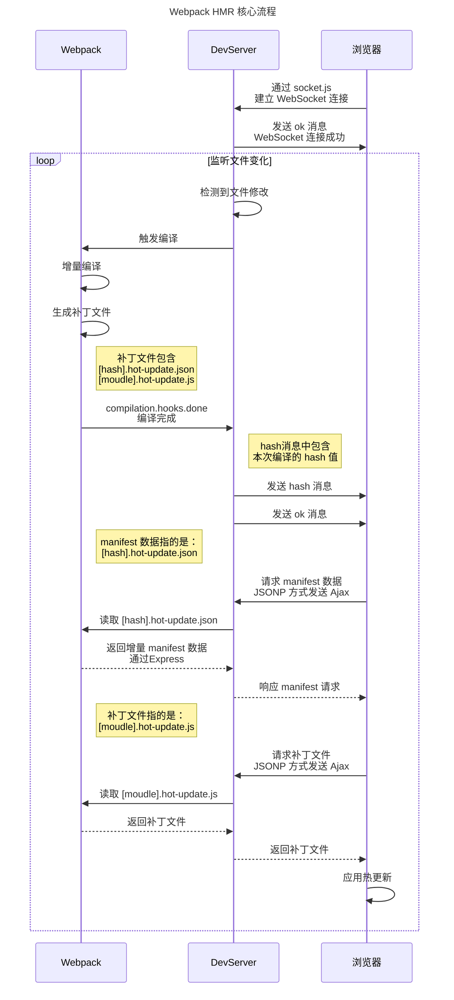
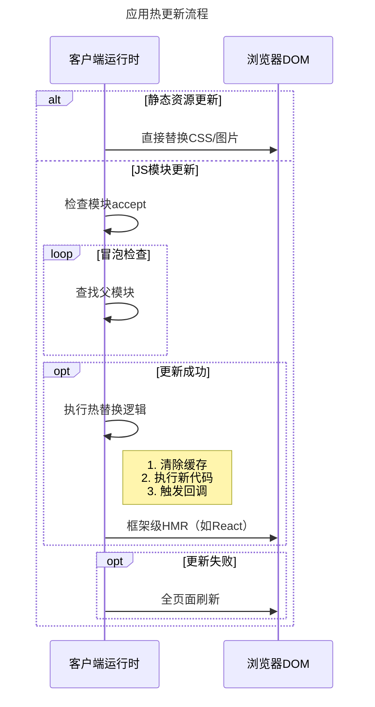

Webpack 的 HMR（Hot Module Replacement，热模块替换）基本流程可以分为以下几个关键阶段：

::: note 总结

- 使用 webpack-dev-server (后面简称 WDS)托管静态资源，同时以 Runtime 方式注入 HMR 客户端代码
- 浏览器加载页面后，与 WDS 建立 WebSocket 连接
- Webpack 监听到文件变化后，增量构建发生变更的模块，并通过 WebSocket 发送 hash 事件
- 浏览器接收到 hash 事件后，请求 manifest 资源文件，确认增量变更范围
- 浏览器加载发生变更的增量模块
- Webpack 运行时触发变更模块的 module.hot.accept 回调，执行代码变更逻辑
- done

:::

## 核心流程图

首先我们来看流程图，然后再去详细分析





## 主要环节

以下没有顺序上的连贯性，仅作为对流程图的补充说明：

### 1. 启用 HMR

在 Webpack 配置中启用 `HotModuleReplacementPlugin`，并配置 `devServer.hot: true`。

```javascript
// webpack.config.js
plugins: [new webpack.HotModuleReplacementPlugin()],
devServer: { hot: true }
```

### 2. 在客户端注入 `runtime` 代码

Webpack 在打包时自动注入 `runtime` 代码，浏览器在打开资源时，自动运行 HMR 客户端代码。

`runtime` 代码主要包含两部分：

- `webpack-dev-server/client`：负责管理和 devServer 之间的 WebSocket 链接，请求 manifest 数据、补丁文件。
- `webpack/hot/dev-server`：用于处理 HMR 运行时的模块补丁替换和状态管理。

### 3、文件变更检测

开发服务器 devServer 使用 `chokidar` 监听文件系统的变化。

### 触发重新编译

当文件被修改时，Webpack 启动增量编译，仅重新构建受影响的模块。

## 生成更新补丁

### 生成 Hash 和 Manifest

Webpack 生成：

- 本次编译的唯一 `hash`（用于标识版本）
- `[hash].hot-update.json`（更新清单，记录哪些模块需要更新）
- `[hash].[module-id].hot-update.js`（包含更新后的模块代码）

### Manifest 信息

Manifest 信息指的就是 `[hash].hot-update.json` 文件的内容，包含了本次编译的 `hash`、需要更新的 `chunk` 以及需要更新的模块。

```json title="[hash].hot-update.json"
{
  "h": "a1b2c3d4", // 本次编译的 hash
  "c": { "main": true }, // 需要更新的 chunk
  "u": ["module1", "module2"] // 需要更新的模块
}
```

- `h`：本次编译的 `hash`，用于标识版本
- `c`：需要更新的 `chunk`：`main` 为入口 chunk
- `u`：需要更新的模块：`module1`、`module2`

## 推送更新通知

### WebSocket 发送消息

服务器通过 WebSocket 向浏览器推送两类消息：

#### 1、`hash` 消息

携带最新编译的 `hash` 值。

```json
[{ "type": "hash", "data": "15b70e9df55bc075daeb" }]
```

#### 2、`ok` 消息

表示编译完成，可以开始更新。

```json
[{ "type": "ok" }]
```

## 客户端处理更新

### 为什么使用 JSONP 方式获取更新？

| jsonp                                        | WebSocket                                              |
| -------------------------------------------- | ------------------------------------------------------ |
| 适合低频次的大数据单向传输                   | 适合高频的短消息双工传输                               |
| 直接通过 Http 下载                           | 处理大数据需要分片传输，过于复杂，且需要对内容进行编码 |
| 动态 `<script>` 标签加载的 JS 文件会自动执行 | 需要额外实现对返回内容的解析和执行                     |
| 可以直接在控制台查看                         | 需要使用工具解析二进制数据                             |

### 检查更新

客户端收到 `ok` 消息后，通过 JSONP 请求 `[hash].hot-update.json` 获取更新清单。

```js
const script = document.createElement("script");
script.src = "[hash].hot-update.json";
document.head.appendChild(script); // 触发 JSONP 加载
```

### 下载更新模块

根据清单动态加载更新的模块代码（如 `1a2b3c.module1.hot-update.js`）。

```js
const script = document.createElement("script");
script.src = "main.a1b2c3d4.hot-update.js";
document.head.appendChild(script); // 触发 JSONP 加载
```

### 应用更新

```javascript
// 伪代码：HMR 核心逻辑
function hotApply() {
  // 1. 从缓存中删除旧模块
  delete require.cache[moduleId];

  // 2. 执行新模块代码
  modules[moduleId] = hotUpdate[moduleId];

  // 3. 触发模块的 `accept` 回调
  callAcceptHandlers();
}
```

## 模块热替换

### 模块更新策略

- 普通模块：直接替换代码，保留模块状态（如 React 组件的 `state`）。
- 有状态模块：通过 `module.hot.dispose` 保存状态，新模块通过 `module.hot.data` 恢复状态。

  ```javascript
  if (module.hot) {
    module.hot.dispose((data) => {
      data.counter = currentState.counter; // 保存状态
    });

    if (module.hot.data) {
      currentState.counter = module.hot.data.counter; // 恢复状态
    }
  }
  ```

### 冒泡更新机制

从变更的模块向上查找，直到遇到：

- 父模块通过 `module.hot.accept` 显式接受更新。
- 未找到 `accept` 则冒泡到入口，触发页面刷新。

## 异常处理

### 更新失败

- 回退到完整页面刷新（可通过 `devServer.hotOnly: true` 禁用）。
- 通过 `module.hot.status()` 获取状态（如 `fail` 或 `abort`）。

### 自动重试

开发服务器会自动重连 WebSocket，确保通信恢复。

## 总结

HMR 的核心流程可以简化为：  
监听变化 → 增量编译 → 推送通知 → 下载补丁 → 替换模块 → 保持状态。  
理解这一流程有助于：

1. 优化 HMR 性能（如缩小 `accept` 范围）。
2. 调试 HMR 失效问题（如检查 WebSocket 连接或模块依赖关系）。
3. 实现框架（如 React、Vue）的热更新集成。
