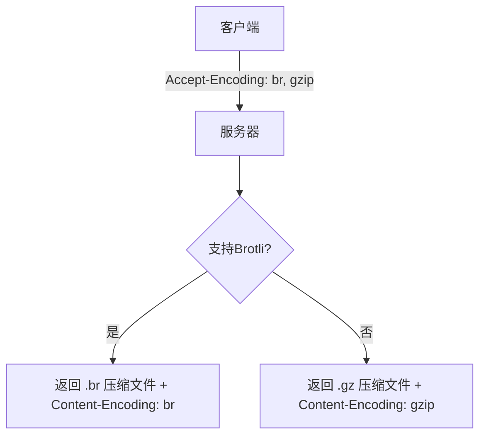

## 简介

Brotli 是 Google 在 2015 年推出的开源通用压缩算法，专为 Web 优化设计，相比 Gzip 平均提升 **20-26%** 的压缩率。以下是其核心技术解析：

## 核心设计思想

### 1、静态字典预加载

- 内置 **13,184 个** 常见 HTML/CSS/JS 短语（如 `<div>`、`function()` 等）
- 覆盖 50% 以上 Web 文本的重复模式
- 字典大小约 **120KB**（已硬编码在算法中）

### 2、动态字典扩展

- 滑动窗口机制（默认 **16MB**）
- 实时记录新发现的重复字符串
- 采用 **增量更新** 策略减少内存开销

### 3、多级上下文建模

同时应用 **4 种上下文模型**：

| 模型类型   | 适用场景                    |
| ---------- | --------------------------- |
| Literal    | 未匹配的原始字符            |
| Dictionary | 静态/动态字典中的短语       |
| Distance   | LZ77 的<距离,长度>指针      |
| Block Type | 数据类型标识（文本/二进制） |

## 压缩流程（分步解析）

### 1、预处理阶段

- 加载静态字典
- 初始化动态字典

### 2、LZ77 压缩核心

- 滑动窗口扫描重复字符串（窗口大小可配置）
- 匹配策略：
  - 优先匹配静态字典（如 `"function"`）
  - 次优匹配动态字典（如用户自定义变量名）
  - 最后用 LZ77 生成 `<distance, length>` 对

### 3、熵编码阶段

对数据块进行组合编码：

- 使用 Huffman 编码对 **高频词** 进行短符号编码
- 使用算术编码对 **低频词** 进行长符号编码

### 4、块结构

每个压缩块包含：

- 块类型（文本/二进制）
- 动态 Huffman 树
- 压缩数据

## 关键技术创新

### 1、上下文感知机制

- 根据前 **2 个字符** 预测当前字符概率
- 例如：在 `"fun"` 后预测 `"c"`（组成 `"function"`）

### 2、距离编码优化

- 将 LZ77 的 distance 参数分为：
  - **短距离**（0-15）：直接编码
  - **中距离**（16-271）：基数值+偏移量
  - **长距离**（>271）：对数分段编码

### 3、零成本字典切换

- 静态字典与动态字典共享索引空间
- 通过最高位标志区分来源：

  ```python
  if (index & 0x8000):
      # 使用静态字典
      phrase = static_dict[index ^ 0x8000]
  else:
      # 使用动态字典
      phrase = dynamic_dict[index]
  ```

## 性能实测数据

> 测试条件：Chrome 116 / i7-1185G7 @3.0GHz

| 测试样本      | 原始大小 | Brotli(11) | Gzip(9) | 提升率 |
| ------------- | -------- | ---------- | ------- | ------ |
| jQuery 3.6.0  | 271 KB   | 70 KB      | 82 KB   | +17%   |
| Bootstrap CSS | 187 KB   | 27 KB      | 33 KB   | +22%   |
| React DOM     | 1.2 MB   | 248 KB     | 312 KB  | +26%   |

## Web 应用场景

### 最佳实践

- **静态资源**：预压缩至级别 11（如 `main.js.br`）
- **动态内容**：实时压缩用级别 4-6（延迟<50ms）
- **Nginx 配置**：

  ```nginx
  brotli on;
  brotli_static on;
  brotli_types text/html application/json;
  brotli_comp_level 6;
  ```

### 兼容性方案



## 算法局限

1. **压缩速度**

   - 级别 11 比 Gzip 慢 **5-10 倍**（但解压仅慢 10-20%）

2. **内存占用**

   - 最高级别需 **数百 MB** 内存（Gzip 仅需几 MB）

3. **二进制文件**
   - 对已压缩文件（如 PNG/MP4）效果有限

Brotli 通过创新的字典设计和上下文建模，在 Web 文本压缩领域树立了新标准。其技术思路也影响了后续算法（如 Zstandard 的字典训练机制）。
