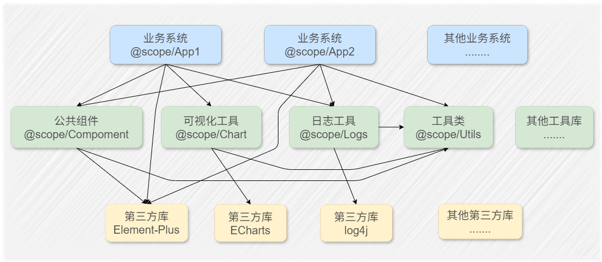

## 传统架构

### 什么是传统架构？

传统架构指的就是我们平时开发的项目，每个项目都有自己的项目结构，项目之间的代码是独立的。一般具备以下几个特征：

- **项目相互独立**：每个项目都有自己的项目结构，项目之间的代码是独立的。
- **技术栈独立**：不同的项目可能使用不同的技术栈和工具链。
- **依赖管理**：项目通过 `node_modules` 管理依赖，可以将一个项目作为另外一个项目的依赖。
- **独立部署**：各自独立部署上线，通常依赖 CI/CD 工具。

### 传统架构的优势

随着业务的发展，我们会创建更多的项目，这些项目之间可能会存在一些重复的代码或功能。我们提取这些重复的代码或功能，将其发布成一个单独的项目，通过 npm 包的方式引入到其他项目中，是一个非常好的选择。

如上图所示，在传统架构中，我们将项目分为以下几个部分：
- **业务应用类**：如 WebApp1、WebApp2。
- **UI 组件类**：我们将项目用到的 UI 组件单独封装并发布成一个单体库。
- **公共方法类**：针对不同操作对象的公共方法库。
- **工具类**：如监控组件、日志组件、文件操作组件等。
- **二次封装类**：对 Echarts、chart.js 等图表库的二次封装等。

### 传统架构的局限性

但是，随着项目数量增加，项目之间的依赖关系可能变得越来越复杂，传统架构的局限性慢慢显现出来：

- **代码耦合度高**：不同项目之间依赖相同的代码或者功能，导致代码耦合度高非常高，已有的公共代码不能随意修改。
- **依赖关系混乱**：项目下不同的依赖包引用了同一个项目的不同版本，导致依赖管理冲突。
- **版本难以管理**：当我们需要修改一个依赖库的代码时，需要根据依赖关系，依次更新每个项目，非常麻烦。

## Monorepo 架构

**Monorepo（Monolithic Repository，即单体仓库）** 是一种将多个项目或模块的代码存储在同一个版本控制仓库中的软件开发架构。与传统的**多仓库（PolyRepo）模式（每个项目独立一个仓库）** 不同，Monorepo 通过统一管理代码，强调代码共享、依赖管理和协作效率。

### Monorepo 架构主要解决了什么问题？

例如以下场景：

在以上的项目中，我们可以看到非常复杂的依赖关系，在实际项目开发中，我们可能会遇到以下场景：

1. 业务系统 A 中，发现 utils 库中的一个方法有问题，需要修改，发现其他业务系统引用了该方法。
2. Echart 发布的新功能，我们想在业务系统 B 中使用，需要更新 chart-tool 库。
3. 业务系统 C 和 chart-tool 库同样引用了 utils 库，但是二者版本不一致，引起了冲突。

4. 进行大规模重构改动的时候，测试一次所有的应用都得部署一次，麻烦、耗时、容易出错，每个项目其实都有一套独立的环境，但是使用的时候完全只从主应用进去，那么是不是只需要一套环境就够了
5. 新同事进行开发的时候需要把所有的库代码都拉下来，一个一个的拉，效率低（为了解决这个问题，我写了一个脚本，可以将 gitlab 一个分组下的项目一次性拉下来，不到 2 分钟就全部搞定了）
6. 子应用架构基本一样，依赖基本相同的，依赖如何复用
7. 代码调试的时候想看对应的子应用得启动对应的子应用，能不能一次全启动起来或者有没有其他的什么方案
8. 应用的 eslint、.babelrc 等通用配置都是一样的，能不能只要一份
9. 新建子应用项目时能不能一键创建好子应用项目和写好对应的主应用的新增代码，然后直接启动起来就能运行

由此我们可以发现以下问题：

1. 代码复用困难：多个仓库重复维护相似代码，导致维护成本高。
2. 依赖版本不一致：不同项目锁定不同版本的依赖，导致运行时错误。
3. 构建和测试效率低：每个仓库需要独立配置 CI/CD，重复构建相同依赖。
4. 跨项目协作复杂：修改涉及多个仓库时，需分别提交 PR，流程繁琐。

### **Monorepo vs. Polyrepo 核心问题对比**

| **问题领域**        | **传统 Polyrepo 痛点** | **Monorepo 解决方案**    |
| ------------------- | ---------------------- | ------------------------ |
| **代码复用**        | 需发布版本，升级延迟   | 直接源码引用，即时生效   |
| **依赖管理**        | 版本冲突，依赖冗余     | 统一安装，依赖提升       |
| **跨项目协作**      | 跨仓库协调成本高       | 原子提交，全局可见性     |
| **工具链一致性**    | 配置重复，流程碎片化   | 统一配置，标准化流程     |
| **微服务/多端协同** | 类型不同步，版本漂移   | 共享代码和类型，统一版本 |
| **代码可维护性**    | 搜索困难，权限管理复杂 | 全局搜索，目录级权限     |

---

### **适用场景总结**

Monorepo 特别适合以下场景：  
✅ **中大型团队**：需要高频协作和代码共享。  
✅ **全栈/多端项目**：如 Web、Mobile、后端服务共享逻辑。  
✅ **微服务架构**：服务间依赖紧密，需保证接口一致性。  
✅ **开源项目**：如 React、Vue 等管理核心库与插件。

**不适用场景**：  
❌ 独立性极强的项目（如完全无关的产品线）。  
❌ 小型团队或项目，工具链复杂度可能得不偿失。

---

### **最终建议**

选择 Monorepo 前需评估：

1. **团队规模**：是否有足够资源维护工具链？
2. **项目关联性**：模块间是否需要高频共享代码？
3. **工具成熟度**：能否接受 Turborepo/Nx 等工具的学习成本？

若痛点集中在上述问题，Monorepo 可能是提升效率的最优解。
